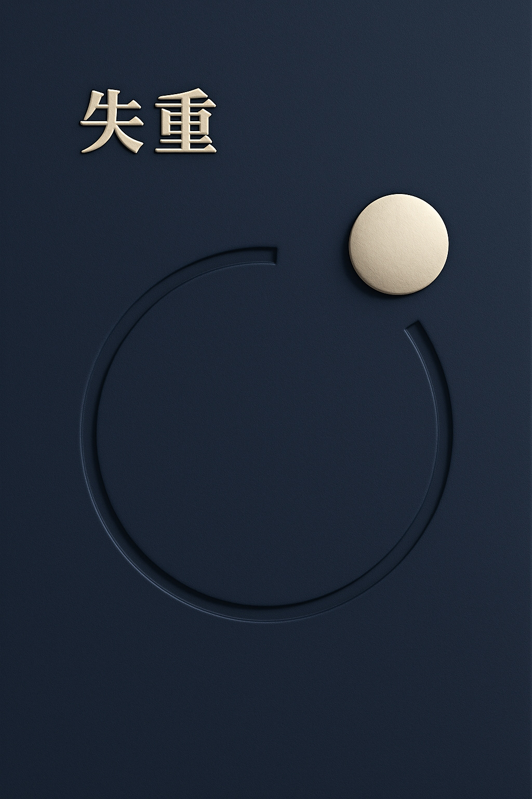
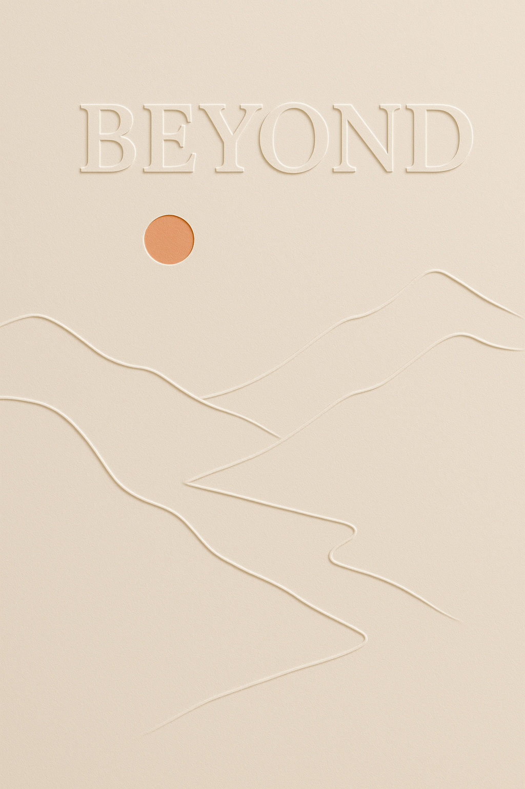
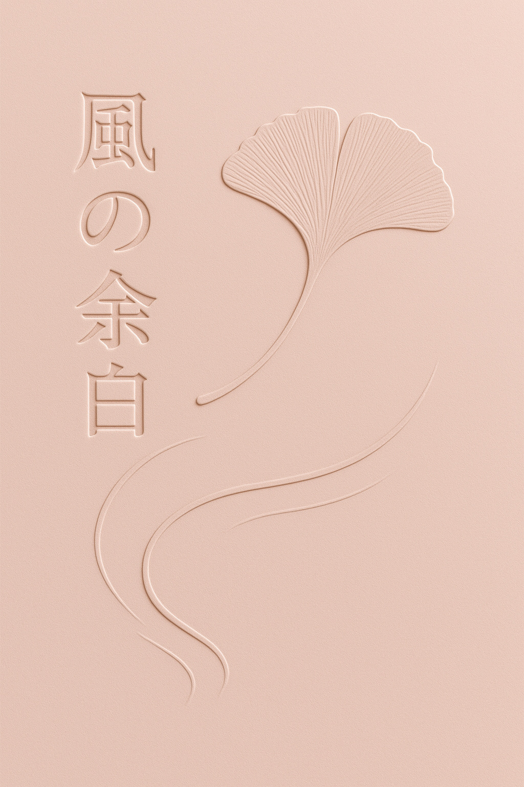
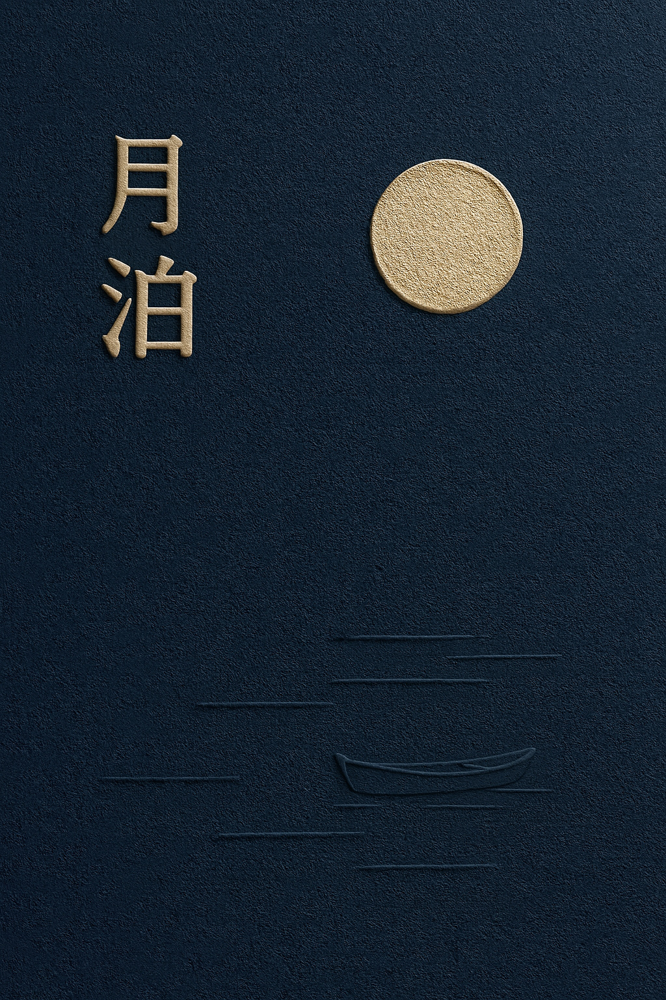
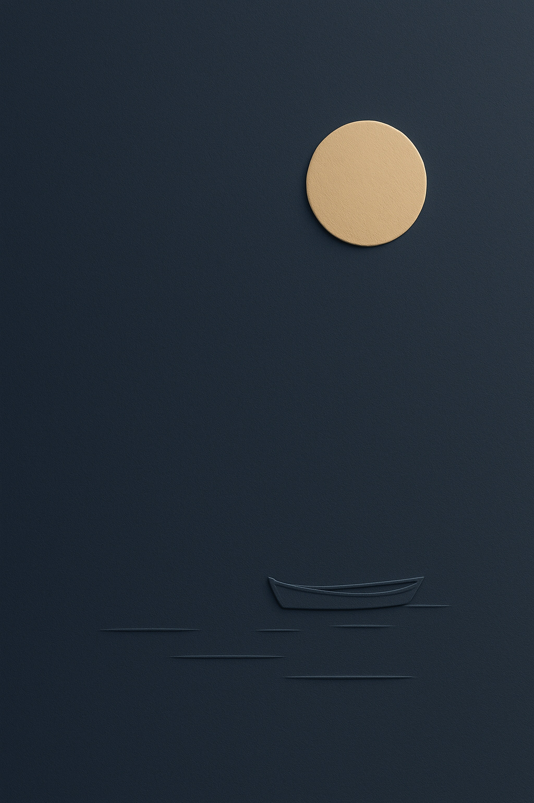

# /emboss-deboss — tactile paper-relief poster style

Turn a theme into a finished artwork that looks physically pressed into thick,
uncoated paper. Typography, a visual metaphor, relief, and empty space form one
composition. The mood is quiet and poetic; the depth is unmistakable at the size
of the complete poster.

## Prompt interpretation

Use the theme, supplied copy, palette, aspect ratio, and preferred relief
treatment to shape the design. Explicit choices override defaults.

- Express the relationship, movement, or feeling behind the theme through one
  concrete visual metaphor.
- Preserve supplied wording exactly. Keep any newly composed headline short and
  omit unrequested supporting copy.
- Choose one composition, palette, typographic treatment, and arrangement of
  raised and recessed elements.
- Default to portrait 2:3. Recompose for square or landscape instead of cropping
  a portrait into another format.

## Locked style

### Paper and light

- One continuous sheet of thick matte cotton or uncoated paper, seen front-on.
  Fine, irregular fibers continue across faces, shoulders, and grooves.
  Broad empty areas stay calm; grain must not compete with the relief edges.
- The design is integral to the sheet, with pronounced sculptural relief.
  A useful starting point is a 2–3 mm rise from dense molded cotton board:
  distinct top faces, substantial shoulders, and visible side walls joining
  the base sheet. Adapt the depth to the motif's scale without losing those planes.
  Keep the rounded shoulders narrow enough to preserve broad top faces.
- One raking side light, upper left by default, roughly 15–25 degrees above the
  paper plane. A broad source softens shadow edges while restrained fill preserves
  the shaded walls and base shadows. All forms share this lighting.
- One or two principal colors, with a small purposeful accent if needed.
  Selected ink colors the raised faces without replacing their physical relief.

### Emboss and deboss

- **Emboss:** a raised matte face, a lit shoulder toward the light, a clearly
  exposed strip of shaded side wall away from it, and an attached cast shadow
  on the surrounding paper. The wall and shadow have enough width to reveal
  height in the complete artwork. Letter counters remain at the lower paper level.
- **Deboss:** a visibly lowered bed between two inner walls, with a shaded
  upper-left wall and a lit opposite wall under the default light. Recessed
  paths have a readable channel width and depth, including at their endpoints.
  Keep the sheet inside a contour at the base level unless the entire area is recessed.
- Include both processes by default: a raised title or main form can sit beside
  a recessed route, water line, leaf vein, or contour. Honor requests for only
  embossing or only debossing. Supporting relief occupies less visual area while
  retaining clearly recessed geometry.
- Give the headline and primary solid form the full face–wall–base profile
  individually. Choose strokes wide enough to carry a readable raised top and
  shoulder. Inked lettering has the same physical height as blind lettering.
  An embossed moon or disk has a broad, gently convex face, a substantial rounded
  shoulder, an exposed side wall, and an attached base shadow around its shaded arc.
- Use blind pressing on a major element where the brief permits: its face keeps
  the paper's color, and coherent edge lighting makes it legible.

### Composition

Build a relationship between forms. A small boat can answer a large moon across
empty water; a distant sun can balance a recessed valley; a leaf can end a wind
path. Choose the metaphor for the theme without automatically repeating these
subjects.

Use one main metaphor and at most two supporting marks. Quiet space often covers
roughly 40–60% of the canvas, adjusted for the brief. Give that space a purpose:
distance, stillness, anticipation, or a path for the eye.

Specify positions, relative scale, and clear gaps. Let text and image share an
axis or contour while protecting every required glyph. Keep the focal hierarchy
clear even when the main forms use the paper's own color.

Create quietness through spacing, color restraint, and few elements. Preserve
pronounced relief in a minimal or poetic composition.

## Variable axes

| Axis | What changes |
| --- | --- |
| Palette | Ivory with forest ink, indigo with muted ochre, blush, sage, charcoal, or butter yellow |
| Metaphor | One theme-specific relationship, such as distance, stillness, growth, or movement |
| Composition | Open field, ascending path, opposite-edge balance, interwoven contour, offset large form, or two unequal groups |
| Typography | Typeface, headline scale, line breaks, and ink or blind treatment, fitted to the actual copy |
| Relief placement | Which focal form rises, which supporting contours recede, and their relative emphasis |

For a varied batch, change at least two unconstrained axes while retaining fine
matte paper, coherent side lighting, readable relief, and the quiet editorial
mood. Preserve any fixed brand system, subject, palette, layout, or exact wording.

## Brief template

Describe one resolved design using these details:

```text
Output: one complete front-on artwork in the requested aspect ratio.
Intent: the theme and one specific visual relationship that expresses it.
Visible content: required motifs and exact supplied copy, if any.
Paper: matte sheet color, fine quiet fibers, continuous material.
Composition: element positions, relative scale, clear gaps, purposeful empty space.
Typography, if present: family, relief-bearing stroke weight, line breaks, ink or blind treatment.
Emboss, if used: named raised faces, substantial shoulders, exposed walls, and attached cast shadows.
Deboss, if used: named lowered beds, channel widths, inner walls, and consistent shading.
Lighting: one low raking side light with restrained fill, revealing height at whole-poster size.
Exclusions: extra text, coarse grain, flat substitutes for relief, incompatible materials.
```

## Worked examples

### Weightless · indigo



An ivory title and isolated disk rise above the indigo board with broad top faces,
exposed side walls, and attached shadows. A deep open orbital channel reveals its
lower bed and inner walls. This example anchors the default relief strength:
all three levels remain distinct in the complete cover, with generous empty space.

### Mountain valley · ivory



A broad blind-embossed headline balances a small orange sun above mountain ridges.
A recessed winding valley leads the eye through the lower half; the open sky
keeps the landscape expansive.

### Wind and ginkgo · blush



A vertical blind-embossed title balances a raised ginkgo leaf across a clear gap.
The leaf's fine recessed veins and a long sunken wind path provide quieter detail
around the prominent paper forms.

### Moon mooring · indigo and ochre



Raised lettering faces a convex ochre moon across the upper field. Their side
walls and attached shadows establish depth; a tiny boat and sparse recessed
water marks balance the lower field.

### Moon and boat · indigo



A large raised ochre moon and a small blind-embossed boat carry the composition.
Their unequal scale and the broad empty middle suggest stillness and distance,
with a few recessed water lines completing the relationship.

## Anti-patterns

- Flat printed lettering, a colored circle, a hairline bevel, or a shaded outline
  used in place of visible raised walls or a recessed channel.
- Flat replacement text that loses the surrounding artwork's relief and lighting.
- Coarse sand or concrete grain, gritty speckles, and oversharpened paper texture.
- Plastic, foam, clay, stone, chrome, glossy bevels, or inflated lettering.
- Deep block extrusion, floating cutouts, detached drop shadows, or glowing halos.
- Accidental tangencies, repetitive contour clutter, or unrelated decorative icons.
- Desks, frames, mockup books, curled sheets, or stacked paper layers unless requested.

## Output evaluation checklist

- At a normal cover-preview size, the title and primary form each show a raised
  face, an exposed side wall, and an attached shadow. Color contrast alone does
  not establish depth. Recessed details show a lower bed and inner walls.
  All forms retain the character of sculpted paper.
- One light direction explains all edges. Fine fibers are visible close up
  without making broad paper areas noisy.
- One coherent metaphor, deliberate scale and spacing, and purposeful negative
  space create a clear focal point even in a thumbnail.
- Any supplied copy is exact, complete, legible, and uncropped, with no extra text.
- The artwork follows the requested aspect ratio, palette, and fixed choices.
