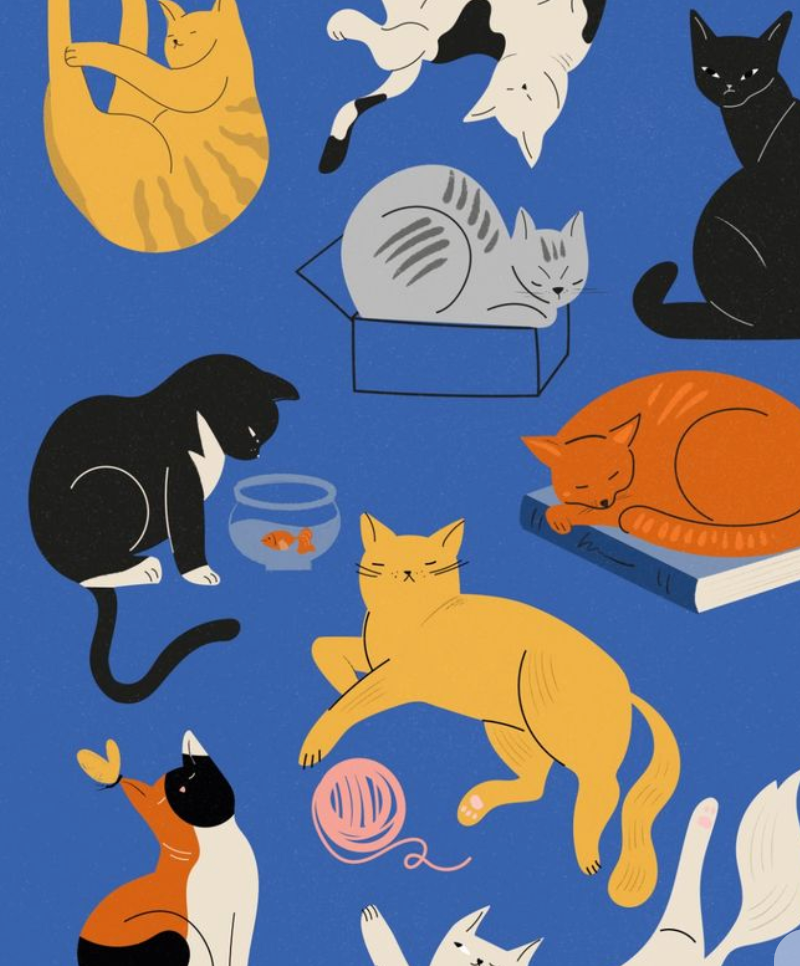
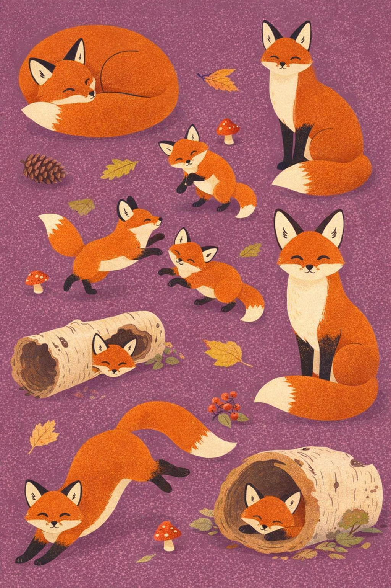
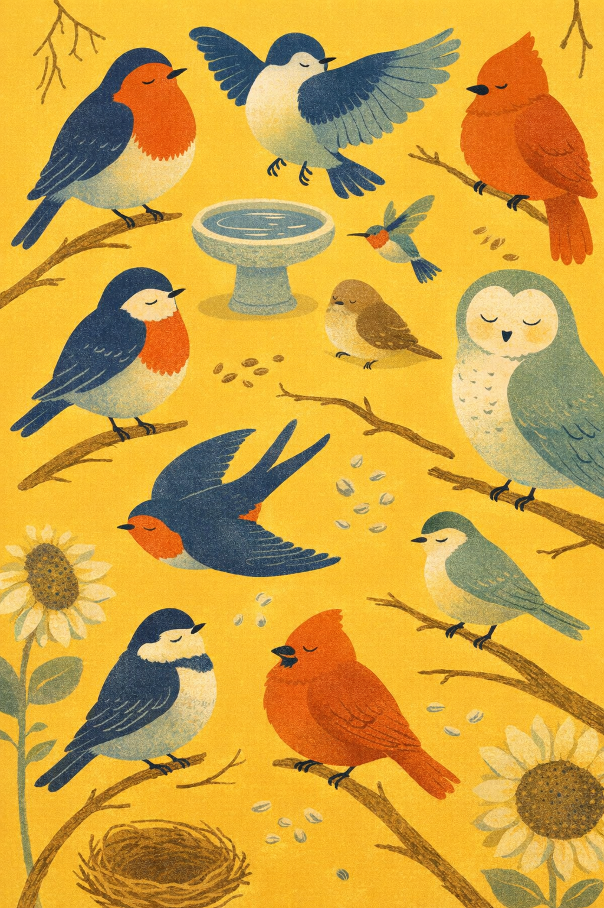
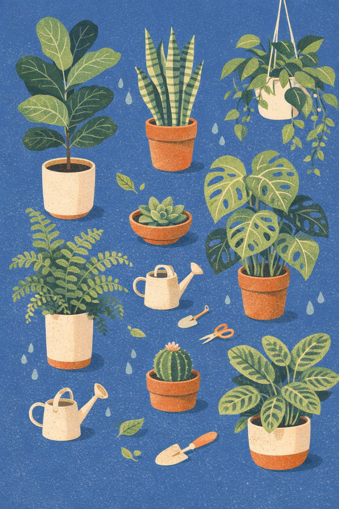
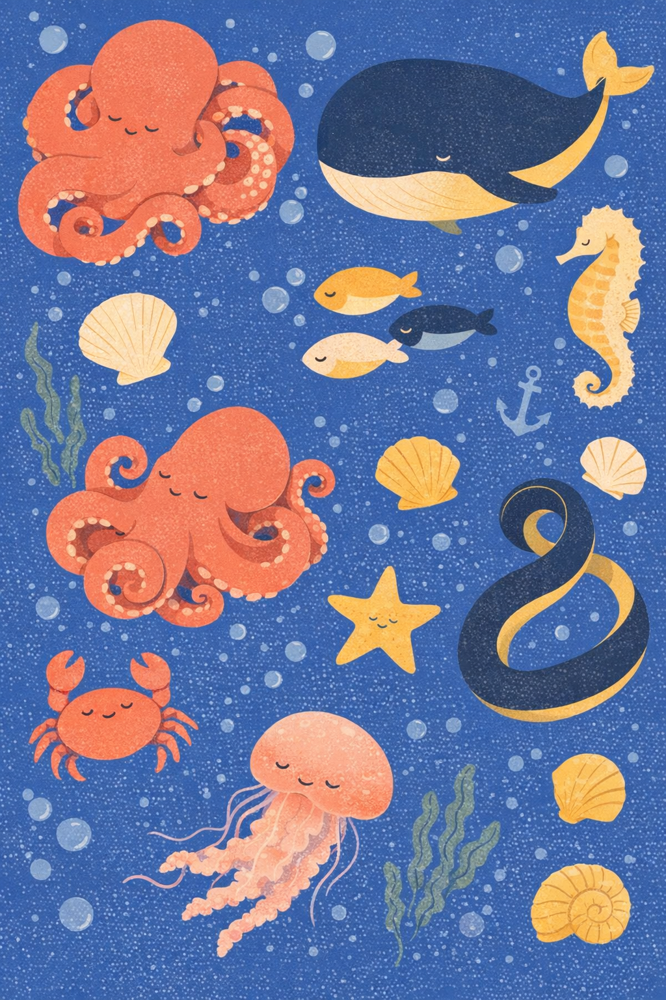
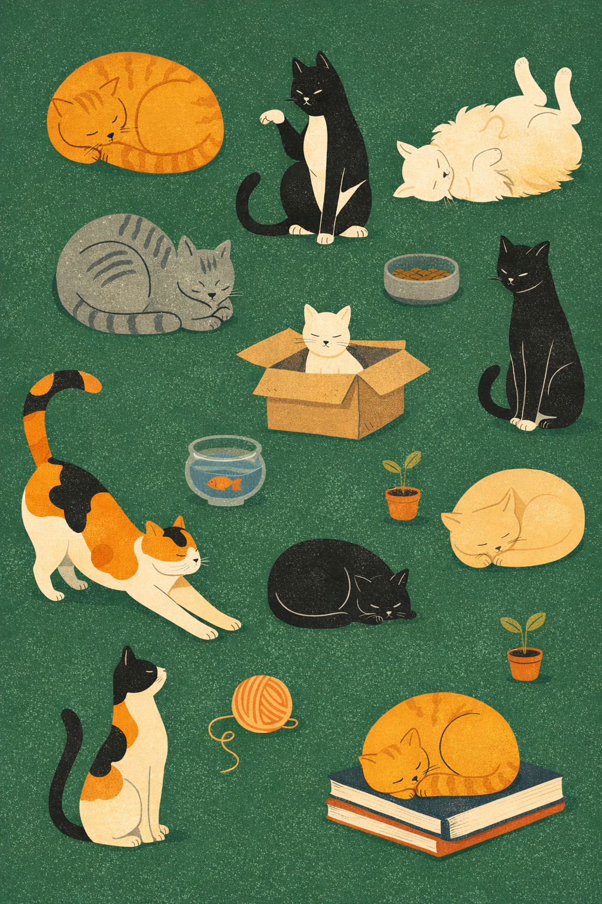

# /endpaper — locked editorial endpaper collection style

This style produces curated "collection" illustrations — many small characters or objects scattered across a fully saturated solid color field, in the spirit of the inside endpapers of a children's picture book. The *mood* is chill (every face is a closed crescent-eye sleepy smile). The *surface* is flat-vector with a subtle riso-print grain inside every fill. The *composition* is a curated scatter that overlaps and touches the canvas edges, never a single hero subject in clean negative space.

Each invocation swaps a small set of dials — the locked frame (riso-grain flat fills, two-tone interior shading, closed-eye faces, saturated background, scattered overlap, props with loose hand-drawn lines) never moves.

## Prompt interpretation

The user will usually give a short brief — sometimes just a cast ("foxes"), sometimes cast + hue ("cats on cobalt"), sometimes a full dial sheet ("sea creatures · cobalt · ocean-coral palette · L3 packed"). Translate that into a full collection brief without stopping to ask:

1. **Pick a cast** — the recurring subject family (animals, objects, or mixed). About 7–12 elements total depending on density.
2. **Pick one saturated background hue** that supports the mood. One color, no gradient, no border.
3. **Pick a character palette** — 4–5 curated fills strictly enforced across every member of the cast.
4. **Pick a density (L1 / L2 / L3)** — L1 sparse (4–5 elements, airy), L2 balanced (7–9 elements, default), L3 packed (9–12 elements edge-to-edge).
5. **Pick a prop vocabulary** matched to the cast — small thematic objects scattered between characters (yarn ball for cats, pinecone for foxes, watering can for plants).
6. **Honor the locked frame** — riso grain, two-tone shading, closed-eye faces, no body outlines, props with loose hand-drawn line details, scattered overlapping composition.

Bias toward chill resting and lounging poses. Cats sleep, foxes curl, birds perch, fish drift. Avoid hard action — no running, jumping, or wide-mouth expressions.

## Locked style axes (NEVER vary)

### Surface

- **Subtle riso/screenprint grain** inside every fill — lightly stippled, never perfectly smooth, never airbrushed
- **Flat solid color fills only** — no gradients, no soft airbrush rendering, no 3D modeling
- The grain is the only texture in the whole canvas — no paper texture, no halftone dot pattern, no noise filter

### Character interior shading

- **Two-tone interior shading on EVERY character** — a darker color on the back/top (back of the animal, top of the leaf, top of the pot) and a lighter color on the belly/bottom, meeting on a soft curved boundary
- Two-tone shading must be applied even on the smallest characters — never skip
- Edge between the two tones is a soft curve, not a hard step, but is still readable as two distinct shapes

### Faces and posture

- **Closed crescent eyes** drawn as a single confident curved line — eyes are never open
- **Tiny dot nose** — a single small mark, not a triangle, not a snout outline
- **Faint whisker / detail marks** are optional but welcome on cats and rodents
- **Chill sleepy smile mandatory** — relaxed mouth line, never grinning, never showing teeth
- **Naturalistic resting anatomy** — loaf, side-curled sleep, sitting upright, standing in a calm stretch, peeking from behind a prop

### Lines

- **NO outlines on character bodies, ever** — characters are pure flat shape silhouettes with internal two-tone shading; never trace the perimeter with ink
- **Loose hand-drawn line details ONLY on props** — yarn spirals, box flaps, fishbowl water lines, leaf veins, pot stripes, sunflower seed spiral, anchor crossbar
- Line work on props is hand-drawn with slight wobble, never mechanically perfect, but stays minimal — line marks accent the prop, never outline its silhouette

### Background

- **One fully saturated single hue filling the entire canvas** — every pixel, edge to edge, no border, no frame, no horizon strip, no vignette
- No white margins, no clipping mask, no decorative border
- Hue is one from the palette dial below

### Composition

- **Portrait canvas, 1024×1536 (2:3) recommended**
- **Scattered curated layout** — characters and props are arranged across the full canvas with intentional balance, like the endpaper of a picture book
- **Characters overlap and touch the canvas edges** — never a clean centered hero with empty borders
- **Density is dialable (L1/L2/L3)** but even L1 has elements crossing the canvas edge
- No baked-in headlines, no captions, no logos, no signature

### Mood

- **Always chill, cozy, slightly nostalgic** — never alarming, never frenetic, never aggressive
- Anthropomorphic personality is fine on animals but stays subtle (a tilted head, a tucked paw); never cartoon-mascot exaggeration

## Variable axes (the five dials)

These are the only things that change between pieces.

### Dial 1 — Background hue

One fully saturated solid color filling the entire canvas.

| Slug | Color | Hex |
|---|---|---|
| cobalt | royal cobalt blue | `#1F3D8A` |
| mossy-teal | deep mossy teal | `#2F5F4D` |
| dusty-plum | dusty plum | `#6B4A6E` |
| butter | warm butter yellow | `#E8C547` |
| terracotta | warm terracotta orange | `#C95A36` |
| slate | dusty slate blue | `#5A7C92` |
| sage | muted sage green | `#7A9568` |
| coral | dusty coral pink | `#E08075` |
| aubergine | rich aubergine | `#4A2A4A` |
| ochre | mustard ochre | `#C4943A` |
| forest | deep forest green | `#2D5A3D` |
| blush | powder blush pink | `#D8A7B5` |
| stone | warm stone grey | `#7A7568` |
| sienna | burnt sienna | `#A04A2A` |
| ink | deep navy ink | `#1E2A4A` |

### Dial 2 — Cast

The recurring subject family populating the canvas.

- **Animal casts** — cats · dogs · foxes · bunnies · garden-birds · sea-creatures · forest-critters (deer / rabbit / hedgehog / squirrel / badger) · desert-animals (camel / jackrabbit / lizard / fennec) · farm-animals · wild-cats (tiger / lynx / leopard) · bears · insects-small (bees / ladybugs / snails / beetles) · mixed-pets
- **Object casts** — houseplants-in-pots · mushrooms · fruits-veg · kitchen-objects · coffee-tea-vessels · stationery · tools-hardware · camping-gear · musical-instruments · sewing-craft · gardening-tools · bath-objects

Object casts are valid — the style is not animal-locked. For object casts, the two-tone shading still applies (darker top, lighter bottom on each pot, leaf, mug, tool, mushroom cap).

### Dial 3 — Character palette

A strictly enforced curated set of 3–5 fills distributed across every member of the cast. Pick one palette per piece. Do not introduce additional hues.

| Slug | Fills |
|---|---|
| warm-earth | ginger orange · charcoal · cream · warm grey |
| cool-forest | rust · cream · charcoal · sage |
| jewel-garden | navy · coral · sage · cream |
| terracotta-sand | terracotta · sage · forest · cream |
| ocean-coral | coral pink · cream · butter yellow · charcoal |
| dusty-pastel | dusty rose · cream · sage · charcoal · butter |
| bold-modern | black · white · terracotta · butter |
| folk-muted | dusty blue · ochre · brick · cream |
| berry-moss | plum · sage · cream · mustard |
| sun-baked | burnt sienna · ochre · cream · olive |
| snow-ink | cream · charcoal · soft grey · one accent |
| cold-ash | slate grey · cream · blush · charcoal |

### Dial 4 — Density

How packed the composition is.

- **L1 sparse** — 4–5 elements, airy, breathing room dominates but elements still touch at least two canvas edges
- **L2 balanced** — 7–9 elements, default editorial scatter, characters fill most of the canvas with deliberate gaps
- **L3 packed** — 9–12 elements, edge-to-edge overlap, minimal background showing, characters touch and overlap each other

### Dial 5 — Prop vocabulary

Small hand-line-detail props scattered between characters. Match props to the cast — these are the cast's natural objects.

| Cast | Native props |
|---|---|
| cats | yarn ball (with spiral) · fishbowl (with fish + water line) · cardboard box · food bowl with kibble · book stack · slipper · mouse toy · potted plant |
| dogs | tennis ball · bone-shaped chew · food bowl · folded blanket · chew rope · paw print · leash · collar |
| foxes | pinecone · red-cap mushroom · autumn leaves · berry cluster · birch log · acorn |
| bunnies | carrot · clover · dandelion · burrow opening · grass blade |
| garden-birds | stone birdbath · scattered seeds · twig · woven nest · sunflower · feather |
| sea-creatures | seashells (spiral + fan) · seaweed strand · simple anchor · round bubbles · starfish · message bottle |
| forest-critters | acorn · mushroom · fern · log · berry cluster · leaf |
| houseplants-in-pots | small watering can · gardening shears · spade · water droplets · fallen leaf · pebble |
| kitchen-objects | salt + pepper shaker · herb sprig · lemon · garlic · wooden spoon · peppercorn |
| coffee-tea-vessels | bean · loose leaf · sugar cube · biscotti · spoon · steam swirl |
| stationery | pencil · paper clip · eraser · sticky note · stamp · ink dot |
| camping-gear | pinecone · ember · enamel mug · kindling · star · marshmallow |
| mushrooms | spores · fallen leaf · twig · moss patch · dewdrop |
| insects-small | flower · leaf · dewdrop · web strand · pollen mote |

For casts not listed, pick 4–6 thematically native small objects from the same world as the cast.

## Brief template

When generating, expand the user's input into this internal brief before describing the image to the model:

```
Cast: <subject family + ~7–12 specific cast members in chill poses>
Background hue: <slug · color · hex>
Character palette: <slug · 4–5 fill names>
Density: L1 / L2 / L3
Props: <4–6 cast-native small objects scattered between characters>
Reinforce: no outlines on character bodies; two-tone shading on every member; riso grain in every fill; saturated background fills every pixel edge-to-edge; no text, no logo, no signature, no border.
```

Drive the model with the i2i path using one of the reference images below as a style anchor whenever the execution environment supports image-to-image — this is the most reliable way to preserve the riso grain and the two-tone interior shading. When only a text-to-image path is available, describe the locked surface explicitly (riso grain in every fill, two-tone shading on every character, no outlines on bodies).

## Worked examples

Six reference pieces below — each holds the locked frame and varies the five dials.

### Example 1 — cats · cobalt · warm-earth · L2 (anchor piece)



- Cast: ginger tabby (loaf, sleeping) · charcoal-grey tabby (loaf with subtle stripes) · tuxedo (sitting tall) · calico (mid-stretch) · cream longhair (belly-up) · white kitten (in cardboard box) · sleeping cream cat (curled) · thin black cat (curled tail, looking at fishbowl)
- Background: `cobalt #1F3D8A`
- Palette: `warm-earth` — ginger orange · charcoal · cream · warm grey
- Density: L2 balanced
- Props: striped yarn ball with spiral · goldfish bowl with one orange fish · cardboard box · food bowl · book stack · tiny potted plant

### Example 2 — foxes · dusty-plum · cool-forest · L2



- Cast: sleeping mother fox (curled loaf) · two tiny fox kits (playing) · sitting fox (bushy tail visible) · mid-stretch fox · peeking fox (half hidden behind log) · alert fox (big ears) · sleeping fox kit (in hollow log)
- Background: `dusty-plum #6B4A6E`
- Palette: `cool-forest` — rust · cream · charcoal · sage
- Density: L2 balanced
- Props: pinecone · red-capped mushroom · autumn leaves · berry cluster · fallen birch log

### Example 3 — garden-birds · butter · jewel-garden · L3



- Cast: plump robin · bluebird (wings half open) · tiny brown sparrow loaf · sleepy round barn owl · yellow finch · tiny hummingbird (hover) · cardinal (puffed up) · black-and-white chickadee · swallow (mid-glide, forked tail)
- Background: `butter #E8C547`
- Palette: `jewel-garden` — navy · coral · sage · cream
- Density: L3 packed (birds nearly edge-to-edge, branches reach into the gaps)
- Props: stone birdbath · scattered seeds · twig · woven nest · sunflower

### Example 4 — houseplants-in-pots · slate · terracotta-sand · L2



- Cast: tall fiddle-leaf fig · holey monstera · striped snake plant · hanging pothos (trailing vines) · round succulent in shallow bowl · curly fern in tall pot · small round cactus (tiny flower) · prayer plant (patterned leaves)
- Background: `slate #5A7C92`
- Palette: `terracotta-sand` — terracotta · sage · forest · cream
- Density: L2 balanced
- Props: small watering can · gardening shears · spade · water droplets · fallen leaf

Object-only cast — proves the style does not require animals. Two-tone shading still applies (darker leaf-tops, lighter leaf-undersides; darker pot rims, lighter pot bodies).

### Example 5 — sea-creatures · cobalt · ocean-coral · L3



- Cast: sleepy curled octopus (tentacles wrapped) · chubby smiling whale · tiny seahorse · school of three round fish · sideways crab · jellyfish (trailing tentacles) · five-pointed starfish · curling eel
- Background: `cobalt #1F3D8A`
- Palette: `ocean-coral` — coral pink · cream · butter yellow · charcoal
- Density: L3 packed
- Props: spiral and fan seashells · seaweed strand · simple anchor · round bubbles

### Example 6 — cats · mossy-teal · warm-earth · L2 (cool background, warm cast)



- Cast: sleeping ginger tabby (loaf) · charcoal grey tabby (loaf with stripes) · tuxedo (sitting tall, paw up) · calico (mid-stretch) · cream longhair (belly-up) · white kitten (in box) · sleeping cream cat (curled on books) · thin black cat (looking at fishbowl)
- Background: `mossy-teal #2F5F4D`
- Palette: `warm-earth` — ginger orange · charcoal · cream · warm grey
- Density: L2 balanced
- Props: yarn ball (with spiral) · goldfish bowl · cardboard box · food bowl · book stack · two tiny potted plants

Demonstrates that the cool-background + warm-character-palette combo holds the style cleanly — ginger and cream pop against the deep teal field.

## Anti-patterns

- ❌ **Outlines around character bodies** — the most common drift; reinforce "NO outlines on character bodies, ever" in the prompt, especially at L3 packed density
- ❌ Skipping two-tone shading on small characters — every member of the cast must have a darker top / lighter belly, even if the character is small in the frame
- ❌ A perfectly smooth flat fill with no riso grain — the grain is the surface signature
- ❌ Photoreal rendering, soft airbrush, 3D modeling, paper texture, halftone dot patterns — the only allowed texture is subtle riso grain
- ❌ Gradient background, vignette, white margin, decorative border, frame — the saturated hue must fill every pixel edge to edge
- ❌ Headlines, captions, in-image text, logos, signatures — never any baked-in typography
- ❌ Open eyes, grinning mouth showing teeth, surprised or fearful expressions — every face is a closed crescent sleepy smile
- ❌ Single hero subject centered in clean negative space — composition must be a scattered curated collection that touches and overlaps the canvas edges
- ❌ Hard action poses (running, jumping, fighting) — chill resting / lounging / sitting / standing-still only
- ❌ Adding a sixth or seventh fill outside the chosen palette — palette discipline is strict
- ❌ Lush over-rendered prop details — props get loose hand-drawn line accents, never full illustration

## Output evaluation checklist

Before declaring a piece done, verify:

- [ ] Every character has two-tone interior shading (darker top, lighter belly)
- [ ] Every fill has subtle riso/screenprint grain — none is perfectly smooth
- [ ] No outline traces around any character body
- [ ] Props carry loose hand-drawn line details (spirals, water lines, leaf veins, pot stripes), not full outlines
- [ ] Every face has a closed crescent eye and a chill sleepy mouth (no open eyes, no teeth)
- [ ] Background is one fully saturated hue filling every pixel of the canvas edge to edge
- [ ] No baked-in text, logo, signature, border, or frame
- [ ] Composition reads as a scattered curated collection, with characters touching and overlapping canvas edges
- [ ] Character palette is the chosen 3–5 fills, with no extras
- [ ] Mood reads as chill / cozy / picture-book-endpaper

## Portability note

This style is described at the semantic level — *what the image must look like*, not which model produces it. It generates most reliably with image-to-image execution using one of the reference images as a style anchor and an input-fidelity-high setting; the reference carries the riso grain and the two-tone shading that text alone struggles to specify. With text-only execution, describe the locked surface explicitly twice in the prompt (once at the top, once in a closing reinforcement) and call out "NO outlines on character bodies, ever" as a separate line. If a model still drifts into outlined cartoon characters, switch to a more recent image-edit checkpoint (gpt-image-1.5 or a comparable late-2025 model) and re-supply the reference image.
