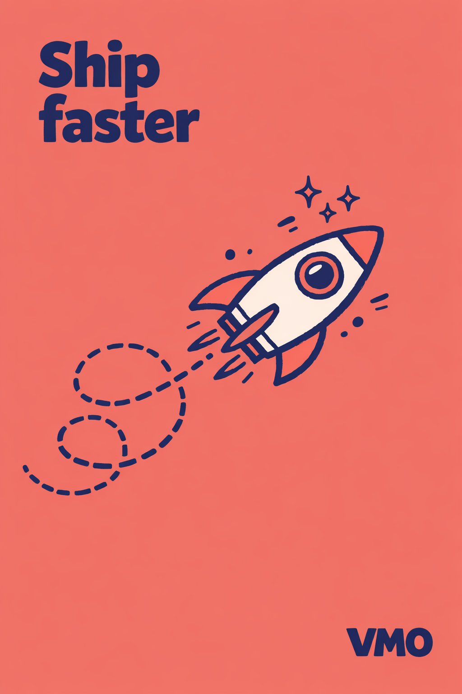
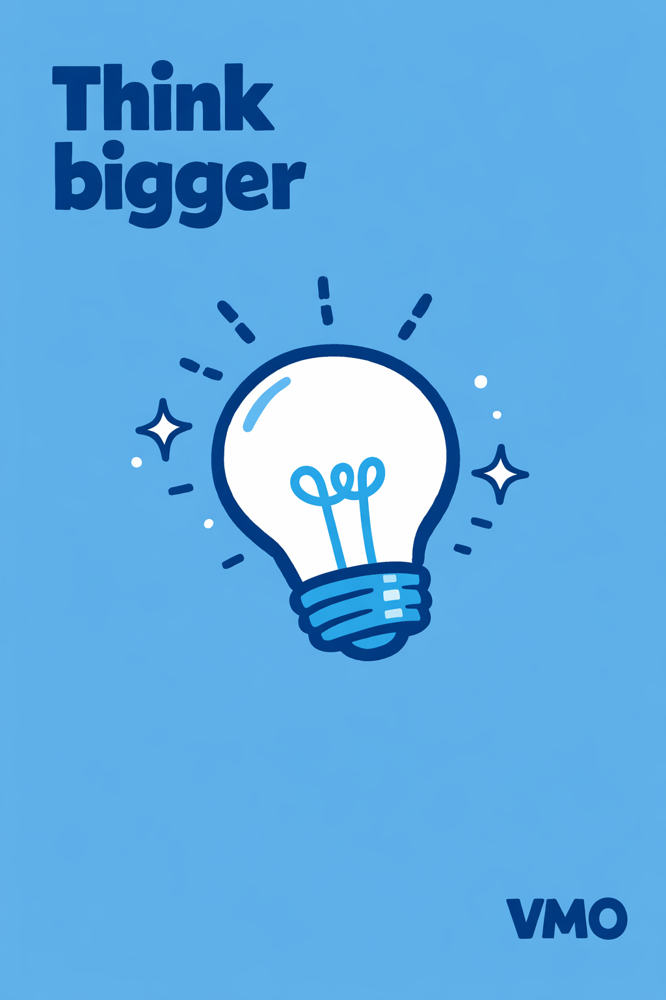
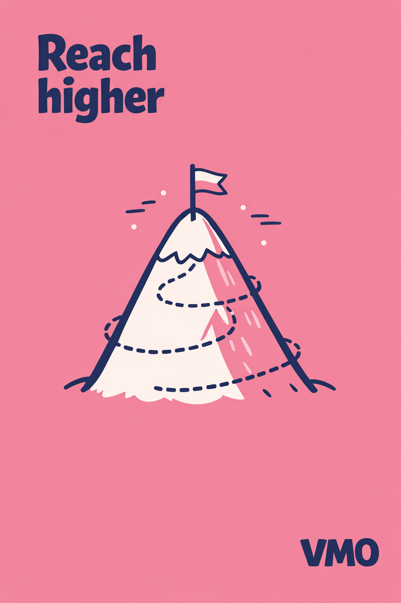
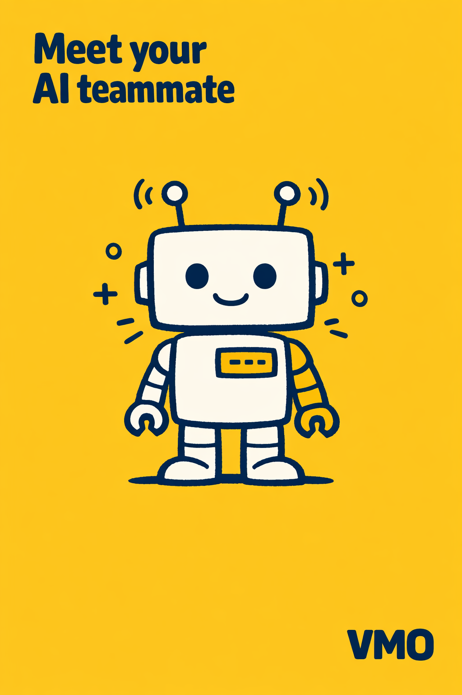
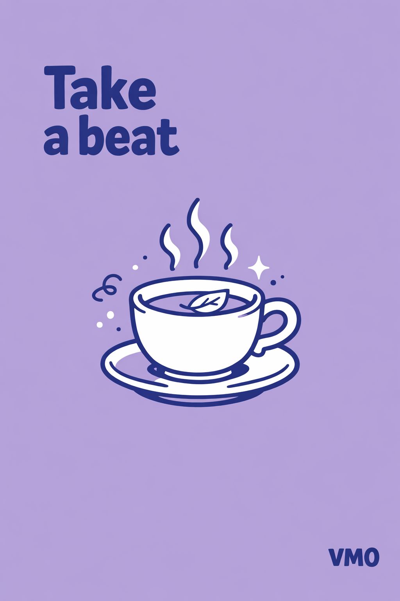
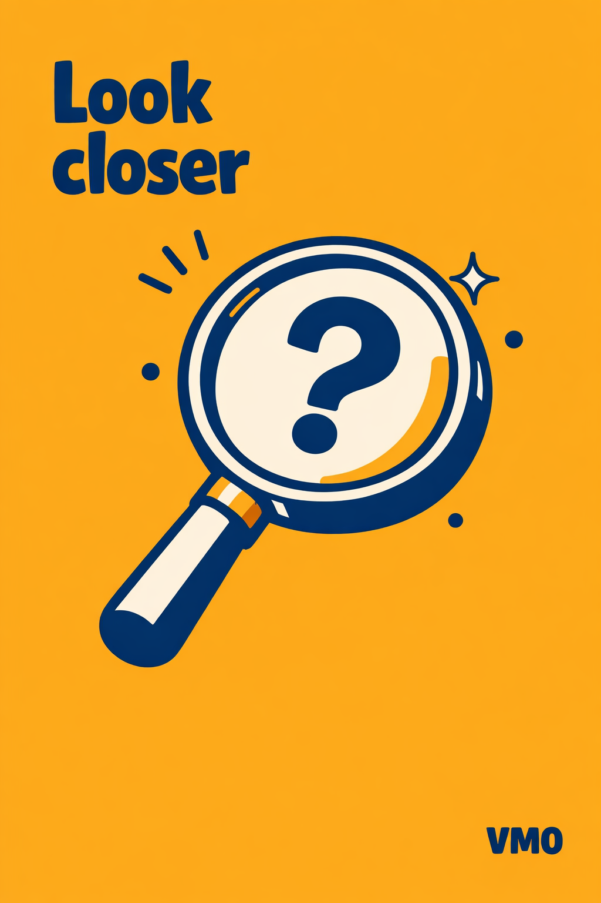
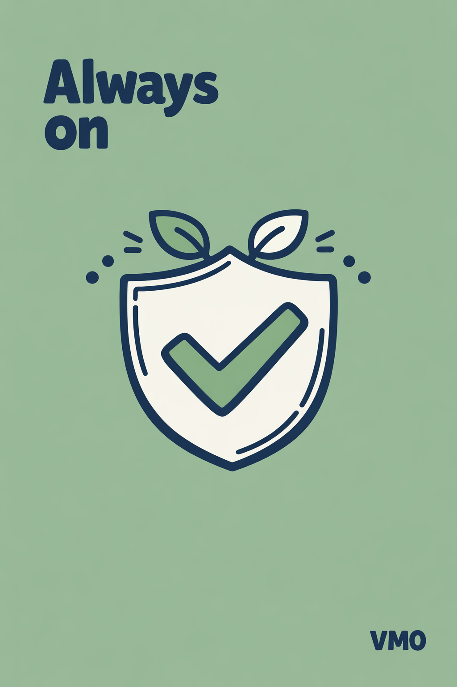

# /flat-poster — locked flat-color editorial poster style

This style produces vertical brand-marketing posters in a single locked recipe: one saturated flat background, one centered hand-drawn vector subject, a bold short headline pinned to the top-left, and a small wordmark pinned to the bottom-right. The visual frame never moves — only six creative dials swap between pieces.

Think Wisevest "core benefits" card meets early-Mailchimp app illustration: confident vector linework with just enough hand-drawn imperfection to feel warm, on a flat color field that does the emotional heavy lifting.

## Prompt interpretation

The user will usually give a short brief — sometimes just a concept ("savings"), sometimes a concept plus a palette ("savings, mint background"), sometimes a full headline ("'Ship faster' on coral"). Your job is to turn that brief into a complete poster spec without pausing for clarification:

1. **Pick a hero subject** from the brief — a single object, character, or scene element that visually carries the concept. One thing, never two.
2. **Choose a saturated background hex** that matches the subject's mood (see palette families below).
3. **Write or refine the headline** — 1–4 words per line, ≤ 3 lines total, deep-navy bold rounded sans-serif. Tight punchy phrasing.
4. **Pick a wordmark** — short brand text for the bottom-right. Default `VM0` unless the user names another (keep ≤ 4 characters; longer names get garbled).
5. **Pick accent marks** — 1–3 categories of hand-drawn dust (dashes, dots, sparkles, curly trails, rays, plus signs, etc.) that fit the subject's emotional world.
6. **Pick a composition preset** — where the subject sits on the canvas (centered-hero by default).

Bias toward subjects that are concrete and iconic: things you can name in one word. Avoid abstract diagrams, photographs, multi-character scenes, or text-heavy graphics.

## Locked style axes (NEVER vary)

### Canvas

- **Portrait 2:3**, recommended 1024×1536 — vertical poster format
- The flat color **fills the entire canvas edge to edge** — no border, no frame, no vignette, no horizon

### Line quality

- **Hand-drawn vector outlines, deep-navy ink** (~7px equivalent at 1024-wide canvas)
- **Slightly imperfect, organic** — tiny gaps where some lines almost meet, never perfectly traced
- Uniform stroke weight on each shape — no calligraphic taper, no pencil scratch

### Fill

- **Strictly two-tone per shape**:
  - Pure white as the main fill
  - One accent area filled in a slightly darker tint of the background hue
- **No third color**, no shading, no gradients, no textures, no highlights, no halftone

### Headline (top-left)

- Bold rounded **heavy sans-serif** in deep-navy, set tight, stacked vertically
- Pinned to the **top-left corner** with comfortable margin from the canvas edge
- Short — typically 2–6 words, broken into 1–3 lines
- Sentence case or all-caps both work; the style prefers sentence case with a strong terminal verb or noun

### Wordmark (bottom-right)

- Same deep-navy sans-serif as the headline, **smaller**
- Pinned to the **bottom-right corner**
- Default text `VM0` — short, 2–4 character brand acronym

### Accent marks

- Floating around the subject, never overlapping its silhouette
- Drawn in the same deep-navy ink at lighter visual weight
- Vocabulary: dashes (motion lines), dots (sparkle / atmosphere), 4-point sparkle stars, curly trails / spirals, light rays, arrows, plus signs, tiny clouds, steam puffs
- 4–10 marks total — sparse but alive
- Pick 1–3 categories per piece; never the full vocabulary at once

### What is NOT in the canvas

- No body copy, no caption line, no subtitle, no tagline, no date, no signature, no disclaimer
- No second illustration, no border frame, no patterned background

## Variable axes (the six dials)

These are the only things that should change between pieces.

| # | Dial | What it controls | Example values |
|---|---|---|---|
| 1 | **Palette** | The single saturated hex filling the canvas + its darker tint accent | warm-bright coral `#F4A07A` · sunny yellow `#F4D35E` · warm-soft dusty rose `#E8A8B8` · terracotta `#D08770` · cool-bright sky blue `#7FB8E3` · electric mint `#9FE0B5` · cool-soft soft lavender `#C5B8E0` · soft sage `#A8C8A1` · punchy magenta `#D8508A` · ultramarine `#5A6BD8` · warm mustard `#E5B341` |
| 2 | **Subject archetype** | The hero illustration sitting on the canvas | tool/object · vehicle/motion · nature/organic · symbol/diagram · character · scene |
| 3 | **Composition** | Where the subject sits on the canvas | centered-hero · off-axis-diagonal · grounded-baseline · layered-scene · close-up-crop · floating-cluster |
| 4 | **Accent marks** | 1–3 categories of hand-drawn dust | dashes · dots · sparkle stars · curly trails · rays · arrows · plus signs · steam puffs |
| 5 | **Headline voice** | The phrasing register of the top-left text | imperative verb · aspirational · declarative noun · three-beat list · question · whisper |
| 6 | **Mood** | The emotional register woven into subject + palette choice | playful · bold · calm · epic · curious · steady |

### Palette families (full reference)

- **Warm-bright** — coral, peach, sunny yellow, butter, terracotta
- **Warm-soft** — dusty rose, blush, sand, mustard
- **Cool-bright** — sky blue, electric mint, periwinkle, teal
- **Cool-soft** — soft lavender, sage, fog, pistachio
- **Punchy** — magenta, vermilion, lime, ultramarine

### Subject archetypes (with examples)

- **Tool / Object** — piggy bank, briefcase, key, magnifier, telescope, hourglass, ladder, cup, scissors
- **Vehicle / Motion** — rocket, paper airplane, hot-air balloon, sailboat, train, bicycle
- **Nature / Organic** — sprouting plant, mountain, tree, cloud + sun, wave, flower
- **Symbol / Diagram** — bar chart, arrow loop, target, shield, trophy, gear, checkmark, lightbulb
- **Character** — robot, animal mascot, anthropomorphic blob, hand
- **Scene** — interior (desk + lamp + plant), landscape, miniature world

### Composition presets

- **centered-hero** — single subject mid-canvas, generous whitespace (default)
- **off-axis-diagonal** — subject angled diagonally, suggesting motion
- **grounded-baseline** — subject sits on implied floor near lower-third
- **layered-scene** — foreground prop + main subject + background accent
- **close-up-crop** — subject fills ~70 % of canvas, more graphic
- **floating-cluster** — two or three small related objects in loose orbit

### Headline voice presets

- **Imperative verb** — "Ship faster", "Save smart", "Look closer", "Move quietly"
- **Aspirational** — "Reach higher", "Start your future", "Build what's next"
- **Declarative noun** — "Your AI teammate", "The new workday", "Less inbox"
- **Three-beat list** — "Co-own. Invest. Succeed.", "Plan. Ship. Repeat."
- **Question** — "Why wait?", "What's next?"
- **Whisper** — "Quietly capable", "Always on" — short, low-key, subtitle feel

### Mood ↔ palette pairing hints

- Playful / friendly → coral, sunny yellow, mint
- Bold / energetic → coral, magenta, electric blue
- Calm / cozy → sage, lavender, sand
- Epic / aspirational → dusty rose, periwinkle, navy-soft
- Curious / discovery → mustard, teal, terracotta
- Steady / trustworthy → sage, navy, slate

## Brief template

When generating, expand the user's input into this internal brief before describing the image:

```
Palette:      <single saturated hex, friendly name>
Subject:      <one specific object/character with pose and detail>
Composition:  <one of the six presets>
Accents:      <1–3 accent categories>
Headline:     <short phrase, 1–3 lines, deep-navy bold sans-serif, top-left>
Wordmark:     <2–4 char brand, deep-navy bold sans-serif, bottom-right>
Mood:         <one short phrase>
```

## Generation guidance

Models with strong typography and clean flat-vector handling (e.g. gpt-image-1.5) produce the most reliable output here. When briefing the model:

- State **explicitly** that the canvas is portrait 2:3, with the flat color filling edge to edge.
- State **explicitly** that the only text on the canvas is the top-left headline and the bottom-right wordmark — no captions, no body copy, no subtitle.
- State **explicitly** that the fill is two-tone: pure white + one darker tint of the background.
- State **explicitly** the stroke style (deep-navy, ~7px, hand-drawn with tiny gaps).
- Name the accent vocabulary explicitly — models otherwise default to generic stars / sparkles everywhere.
- Keep the wordmark short (2–4 chars). Longer brand names get garbled regardless of model.

If the model adds extra body text, regenerate or reduce the subject brief to make room.

## Worked examples

Seven reference pieces below — each holds the locked frame and varies the six dials. The first four are the VM0 launch set; the last three demonstrate the calm / curious / steady mood quadrants.

### Example 1 — rocket · coral · "Ship faster" (bold + off-axis)



- Palette: warm-bright coral `#F4A07A`
- Subject: cartoon rocket ship pointed diagonally up-right
- Composition: off-axis-diagonal
- Accents: curly dashed motion trail + sparkle stars
- Headline: "Ship faster" (imperative)
- Mood: bold / energetic

### Example 2 — lightbulb · sky blue · "Think bigger" (curious + centered)



- Palette: cool-bright sky blue `#7FB8E3`
- Subject: lightbulb tilted slightly, filament loop visible
- Composition: centered-hero
- Accents: dashed light rays + 4-point sparkle stars + scattered dots
- Headline: "Think bigger" (imperative)
- Mood: curious / discovery

### Example 3 — mountain · dusty rose · "Reach higher" (epic + grounded)



- Palette: warm-soft dusty rose `#E8A8B8`
- Subject: mountain peak with a small triangular summit flag
- Composition: grounded-baseline
- Accents: spiral dashed trail + scattered dots
- Headline: "Reach higher" (aspirational)
- Mood: epic / aspirational

### Example 4 — robot · sunny yellow · "Meet your AI teammate" (playful + grounded)



- Palette: warm-bright sunny yellow `#F4D35E`
- Subject: friendly cartoon robot with antennae, square head, simple eyes
- Composition: grounded-baseline
- Accents: plus signs + dashes near the antennae + scattered dots
- Headline: "Meet your AI teammate" (declarative noun)
- Mood: playful / friendly

### Example 5 — tea cup · soft lavender · "Take a beat" (calm + centered)



- Palette: cool-soft soft lavender `#C5B8E0`
- Subject: ceramic tea cup with saucer and three curly steam wisps rising
- Composition: centered-hero
- Accents: curly steam wisps + scattered dots + tiny sparkle near rim
- Headline: "Take a beat" (imperative, gentle)
- Mood: calm / cozy

### Example 6 — magnifier · warm mustard · "Look closer" (curious + close-up)



- Palette: warm-soft mustard `#E5B341`
- Subject: large magnifying glass tilted 30°, lens framing a tiny question-mark
- Composition: close-up-crop
- Accents: short dashed rays from the lens + dots + one sparkle on the rim
- Headline: "Look closer" (imperative)
- Mood: curious / discovery

### Example 7 — shield · soft sage · "Always on" (steady + centered)



- Palette: cool-soft soft sage `#A8C8A1`
- Subject: heraldic shield with a bold center checkmark, two leaves sprouting from the top
- Composition: centered-hero
- Accents: small dot halo + short dashes near the leaves
- Headline: "Always on" (whisper / declarative)
- Mood: steady / trustworthy

## Iteration tips

- **Headline overflows or wraps awkwardly** — shorten to ≤ 2 words per line, ≤ 3 lines total.
- **Wordmark misspelled** — keep to 2–4 characters; longer names garble across all current models.
- **Outline too thin or papery** — emphasize "very thick deep-navy outlines, no fine interior detail" in the subject brief.
- **Background not saturated enough** — bump the hex one step deeper (e.g. `#A5A8E0` → `#8A8FE0`).
- **Model adds an unwanted body caption** — restate the no-extra-text constraint and regenerate; usually clears on retry.
- **Accent marks crowd the subject** — drop to a single accent category; the style breathes better at lower density.
- **Two-tone fill drifts into multiple tints** — restate "strictly two-tone: pure white + one darker bg-tint, no third color".
