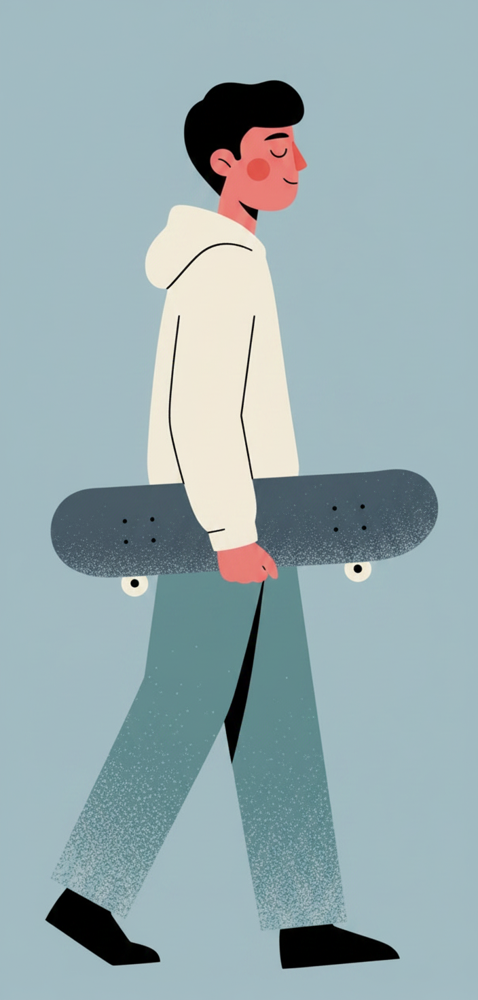
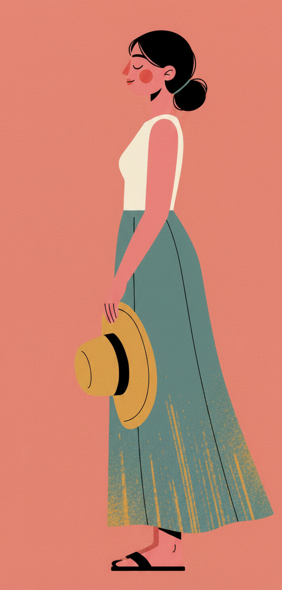
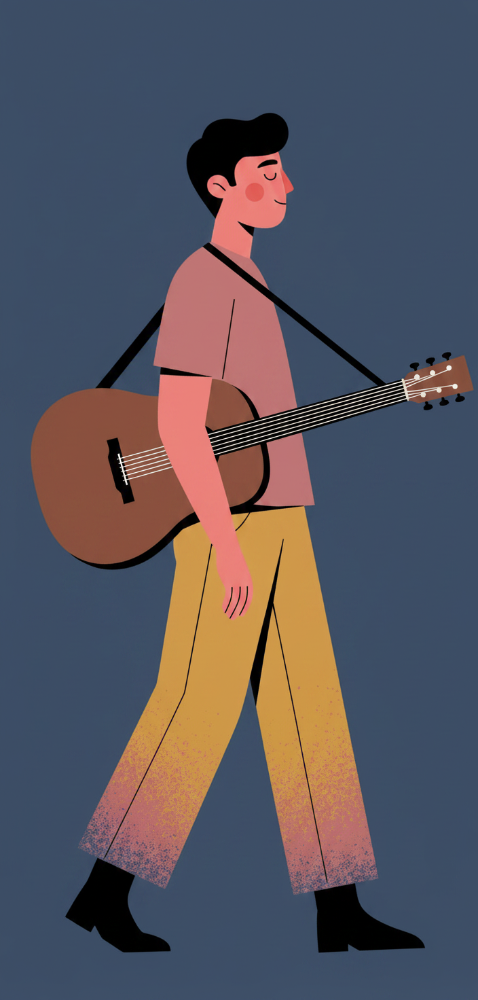
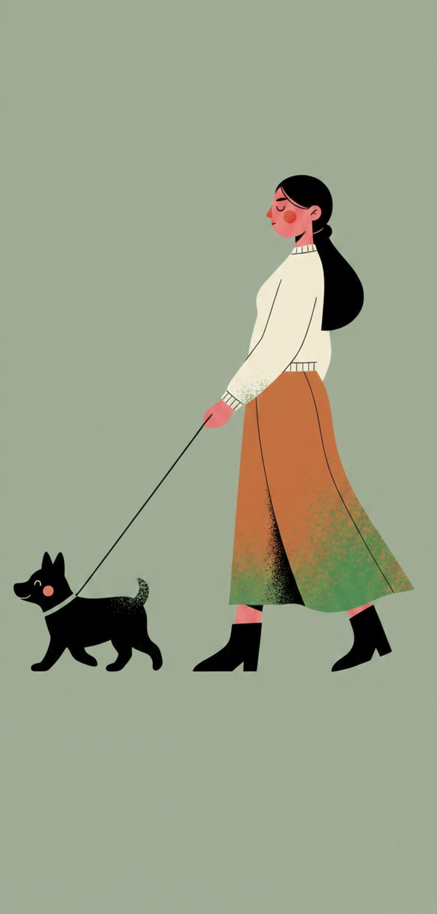
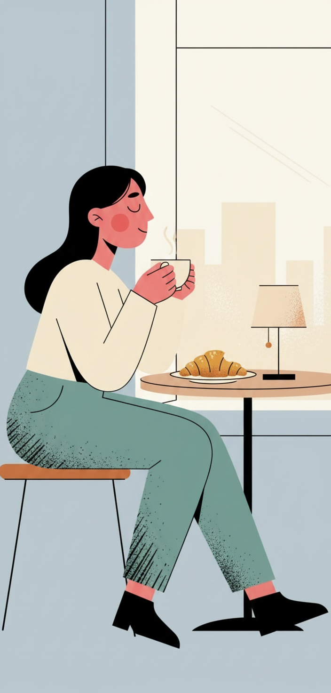
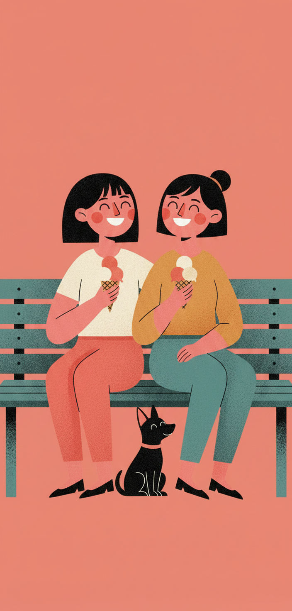
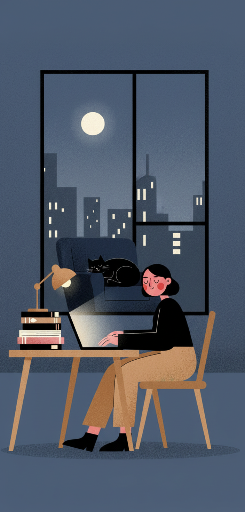

# /grain-poster — locked flat-vector editorial poster style

This style produces serene, full-body figure posters in a locked editorial system. The *visual signature* is the riso/halftone grain that lives only on one textile element (skirt or trousers), against otherwise pure flat-vector silhouettes. The *mood* is contemplative — every figure wears a closed-eye smile with a single round red blush on the cheek. The *format* is editorial poster — vertical canvas, generous negative space, one hero prop telling the whole story.

Each invocation swaps a small set of dials. The locked frame (face, line quality, grain-on-textile rule, poster framing) never moves.

## Prompt interpretation

The user will usually give a short brief — sometimes just a scene ("man with a skateboard"), sometimes a scene plus a palette ("woman with sun hat, sunset coral"), sometimes a fuller mini-scene ("two friends on a bench with ice cream, coral palette, joyful"). Translate that into a full poster brief without stopping to ask:

1. **Pick a hero prop** that anchors the figure's pose. The prop is the metaphor — bicycle, bouquet, cat, book, skateboard, sun hat, guitar, dog leash, umbrella, suitcase, surfboard, watering can.
2. **Pick a palette** (5–6 colors total) — see the palette dial below for named systems or define a custom set.
3. **Pick a cast** (solo, pair, parent-child, group + pets) — solo is the strongest default.
4. **Pick a complexity** (L1 / L2 / L3) — L1 is the recommended default for this style; L2/L3 introduce scene props or full environments but begin to lose the poster simplicity.
5. **Pick a framing** — side profile is the strongest default. Three-quarter and wide-scene are available when the brief justifies it.
6. **Pick a mood** that subtly shapes pose and palette choices (calm, focused, joyful, melancholic, tender).
7. **Honor the locked frame** — face, grain-on-textile, flat fills elsewhere, limited palette, editorial framing — those never move.

Bias toward calm everyday moments where the figure interacts gently with the prop (cradling, carrying, walking with, holding up). Avoid hard action, conflict, or surprise — the figure is always serene.

## Locked style axes (NEVER vary)

### Character face & head

- **Closed-eye smile** — eyes drawn as soft short curved lines tilted slightly down, never open
- **A single round red blush** on the visible cheek — circular, saturated, sits high on the cheek under the eye
- **A small dark nose dot or short nose curve** on the silhouette between eye and mouth — never omit
- **Solid black hair** as a flat shape, no strands rendered, no highlights
- **Smooth pink-red skin tone** as a single flat fill — no rendering, no blush gradient, no second tone

### Line quality

- **No outlines, or only the faintest hairline outlines** where two same-value shapes meet — this is a silhouette-first style, not an ink-line style
- Shapes read entirely from flat color blocks, not from drawn linework
- No double-stroke, no hand-drawn wobble, no sketch marks

### Surface (the signature rule)

- **Riso / halftone grain texture lives on ONE textile element only** — typically the skirt or trousers. That single element holds all the grain in the piece.
- The grain is two-toned: the textile's base color plus a secondary accent that "splashes" upward from the hem (sage-green on rust, blue on teal, mustard on teal, sage on ochre, etc.)
- **Every other surface in the canvas is pure flat fill** — no grain on the background, no grain on the sweater, no grain on the hero prop, no grain on the skin or hair
- No gradients, no airbrush, no cel-shading, no paper texture anywhere else

### Background

- **One muted single hue filling the entire canvas** — no gradient, no vignette, no horizon strip, no second color band
- The hue is chosen from the palette dial; it is muted/desaturated, never electric
- No white margins, no border, no frame

### Composition

- Portrait canvas, 9:16 or 2:3 recommended
- **Full-body figure** — head to feet always visible
- **Generous negative space** around the figure — the figure occupies the central vertical column, not edge-to-edge
- One hero prop interacts with the figure; no secondary characters or scene props at L1
- No text, no logos, no captions, no headlines

## Variable axes (the six dials)

These are the only things that should change between pieces.

| # | Axis | What it controls | Example values |
|---|---|---|---|
| 1 | **Palette** | The named or custom color system for the piece | `cool-dawn` (powder blue + cream + dusty teal + pink-red skin + black) · `sunset-coral` (coral + mustard + dusty teal + cream + pink-red skin + black) · `twilight` (deep navy + mustard + dusty pink + cream + pink-red skin + black) · `forest-green` (sage + ochre + cream + pink-red skin + black) · custom hex set |
| 2 | **Mood** | The emotional tone the piece carries; subtly shapes pose & palette | calm · focused · joyful · melancholic · tender |
| 3 | **Scene** | Where the figure is — empty poster vs. environmental | `empty-poster` (default, no scene) · `domestic-interior` · `cafe` · `outdoor` · `workspace` |
| 4 | **Cast** | Who is in the frame | `solo` (default) · `pair` · `parent-child` · `group-plus-pets` |
| 5 | **Complexity** | How much beyond the hero prop is drawn | `L1` (figure + one hero prop, default — strongest in this style) · `L2` (figure + 2–3 scene props) · `L3` (full environment with depth) |
| 6 | **Framing** | The angle on the figure | `side-profile` (default — strongest in this style) · `three-quarter` · `wide-scene` |

## Brief template

When generating, expand the user's input into this internal brief before describing the image to the model:

```
Cast:        <solo / pair / parent-child / group+pets>
Hero prop:   <one named, specific prop>
Action:      <one-line description of how the figure interacts with the prop>
Framing:     <side-profile / three-quarter / wide-scene>
Palette:     <named palette OR list of 5–6 hexes>
Background:  <single muted hue from palette>
Textile:     <which clothing piece carries the grain — skirt or trousers>
Grain tone:  <the secondary color of the grain splash on that textile>
Mood:        <calm / focused / joyful / melancholic / tender>
Complexity:  <L1 / L2 / L3>
```

## How to ask the model

This style works best as image-to-image: pass one of the reference images below as a style anchor, then write a prompt that:

- Names the new subject + framing + action
- Names the palette and which hue is the background
- States which textile carries the grain and what the secondary grain tone is
- Restates the locked face rule (closed-eye smile, single round red cheek blush, solid black hair) for every figure
- Names "editorial poster composition" to lock the framing

Keep the prompt to one paragraph. The model anchors strongly on the reference image's style, so the prompt's job is to override the scene and palette, not to re-describe the technique.

Evaluation rubric for the returned image — if any of these fail, regenerate:

- Grain shows up on exactly one textile element, and the rest of the image is flat color
- Face holds the closed-eye smile + single round red blush + dark nose mark
- Palette stays inside the named set; no foreign hues sneak in
- Figure is full-body with generous negative space around it
- No text, no captions, no logos appear on the canvas

## Worked examples

Seven reference pieces below — four hold the locked frame across the four named palettes at L1 (the strongest baseline), three push beyond L1 to show L2/L3 scene-complexity and multi-figure cast.

### Palette reference set — L1 (the recommended baseline)

These show the same L1 framing across the four named palettes — the cleanest demonstration that the style is palette-agnostic when the grain-on-textile rule is held.

#### B1 — skateboard · cool-dawn · L1 · solo



- Hero prop: skateboard tucked under right arm
- Palette: cool-dawn (powder blue · cream · dusty teal · black · pink-red skin)
- Background: pale powder blue
- Textile: trousers, dusty-blue grain splash
- Mood: focused

#### B2 — sun hat · sunset-coral · L1 · solo



- Hero prop: large floppy mustard sun hat dangling from one hand
- Palette: sunset-coral (coral · mustard · dusty teal · cream · black · pink-red skin)
- Background: dusty coral pink
- Textile: skirt (dusty teal), mustard-yellow grain splash
- Mood: joyful

#### B3 — guitar · twilight · L1 · solo



- Hero prop: acoustic guitar slung across the back with a strap
- Palette: twilight (deep navy · mustard · dusty pink · cream · black · pink-red skin)
- Background: deep dusty navy
- Textile: trousers (mustard), dusty-pink grain splash
- Mood: melancholic

#### B4 — dog walker · forest-green · L1 · solo



- Hero prop: leash attached to a small black dog walking alongside
- Palette: forest-green (sage · ochre · cream · black · pink-red skin)
- Background: muted sage green
- Textile: skirt (ochre), sage-green grain splash
- Mood: calm

### Scene-complexity reference set — L2 / L3

These three reference pieces push beyond L1's "figure + one hero prop" into environmental scenes and multi-figure cast. The locked frame still holds (closed-eye face, blush, grain confined to a single textile, muted palette, no headlines) — the scene around the figure expands.

#### C1 — café · cool-dawn · L2 · solo



- Scene: woman seated sideways at a small café table by a window, holding a coffee cup in both hands
- Hero props (L2): coffee cup · croissant on a plate · small table lamp · window
- Palette: cool-dawn (powder blue · cream · dusty teal · black · pink-red skin)
- Background: pale powder blue
- Textile: trousers (dusty teal), faint blue grain splash
- Cast: solo
- Framing: side-profile
- Mood: contemplative

#### C2 — bench · sunset-coral · L2 · pair + pet



- Scene: two friends sitting side-by-side on a teal park bench, both holding ice cream cones, a small black dog at their feet
- Hero props (L2): ice cream cones (×2) · park bench · small dog
- Palette: sunset-coral (coral · mustard · dusty teal · cream · black · pink-red skin)
- Background: dusty coral pink
- Textile: trousers/skirt of both figures hold the grain accents
- Cast: pair + pet
- Framing: three-quarter (both figures facing camera)
- Mood: joyful

#### C3 — twilight desk · twilight · L3 · solo



- Scene: full interior — figure at a wooden desk under a small lamp, working on a laptop, stacks of books beside them, a cat curled on a chair behind, a tall window showing a moonlit city skyline
- Hero props (L3): desk · lamp · laptop · books · cat · window · moon · city silhouette
- Palette: twilight (deep navy · mustard · dusty pink · cream · warm beige · pink-red skin)
- Background: deep dusty navy
- Textile: mustard trousers carry the grain (in this L3 the grain is subtler — the scene props compete for visual weight)
- Cast: solo (+ cat as environmental detail)
- Framing: wide-scene
- Mood: focused / quiet

> **L2/L3 note:** as complexity climbs, the grain texture tends to weaken because the model spends visual budget on scene props. To hold the signature, restate the grain rule explicitly in the prompt ("grain confined to the trousers/skirt only; flat color everywhere else").

## Anti-patterns

Things this style is **not** and should not drift into:

- **Grain everywhere.** Grain belongs on exactly one textile element. Grain on the background, sweater, hero prop, or skin will read as a different style (riso poster, screen print). Pull the grain back to just the one textile.
- **Open eyes or detailed facial features.** The locked face is the closed-eye smile + single round red blush + dark nose mark. Open eyes, irises, eyelashes drawn out, teeth, or detailed facial shading break the style.
- **Outlines.** This is a silhouette-first system; do not add black inked outlines around shapes the way `inkstomp`, `riso-relic`, `flat-poster`, or `ink-mascot` do.
- **Saturated electric backgrounds.** Backgrounds here are *muted* — powder blue, dusty coral, dusty navy, sage. Electric hot pink or neon green will fight the closed-eye serenity of the figure.
- **Crowded scenes at L1.** L1 means figure + ONE hero prop and nothing else. Adding furniture, second figures, or scene props pushes the piece into L2/L3 and softens the poster framing.
- **Headlines or captions.** This style is figure-only. Headlines, banners, wordmarks, and captions belong in the sibling `flat-poster` or `ink-mascot` styles.
- **Three-figure compositions when cast=solo.** Respect the cast dial — solo means one human figure (plus optional pet); a second human turns it into `pair`.

## Cousins in the registry

If your brief feels closer to one of these, route to it instead:

- `mellow-pop` — also flat-vector + closed-eye smile, but with thin black outlines, saturated solid backgrounds, and a locked leaf-green pop signature
- `flat-poster` — flat-vector poster with a bold headline + wordmark + outlined subject
- `riso-relic` — riso grain everywhere on a single nostalgic object, no human figure
- `ink-mascot` — single anthropomorphic object with stick limbs + headline, no human figure
- `folk-muse` — gouache folk-art chest-up portrait, painterly not flat-vector

`grain-poster` is the right pick when you want a full-body human figure, a single hero prop, riso grain on textile only, and no headline.
