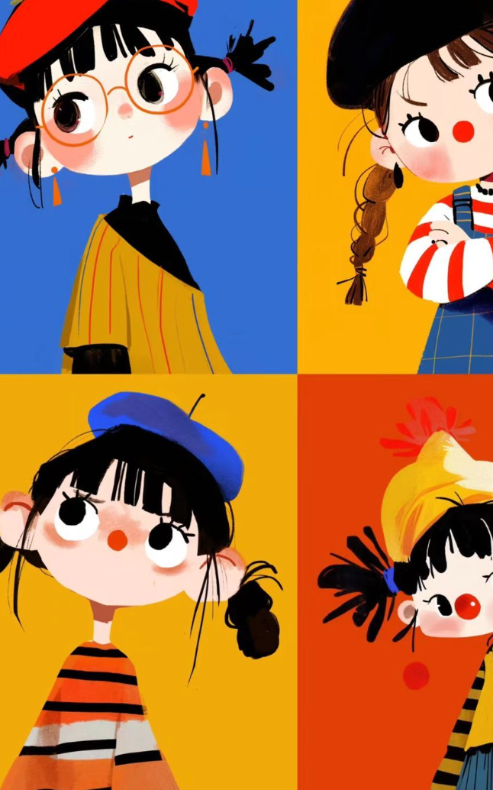
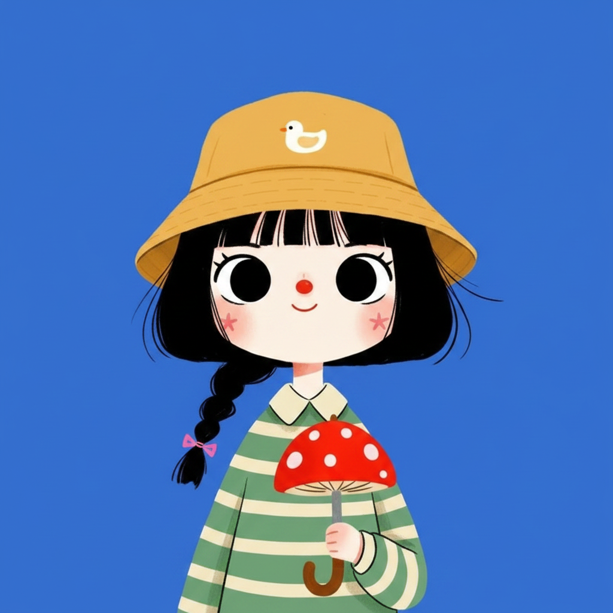
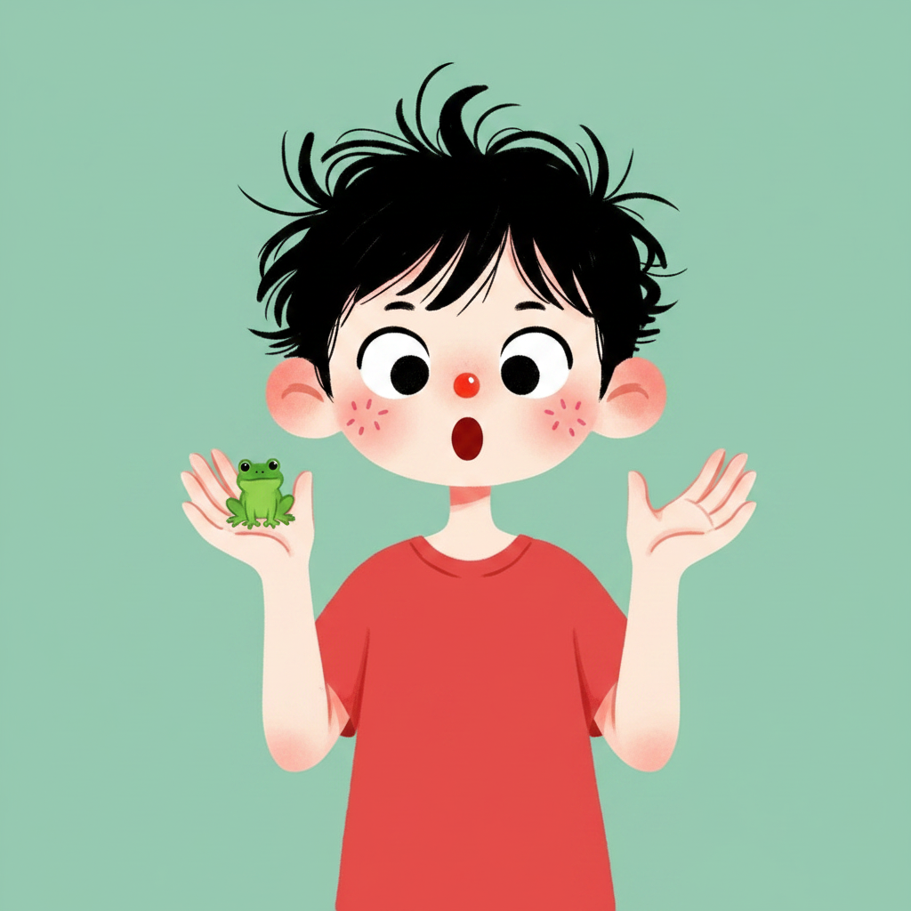
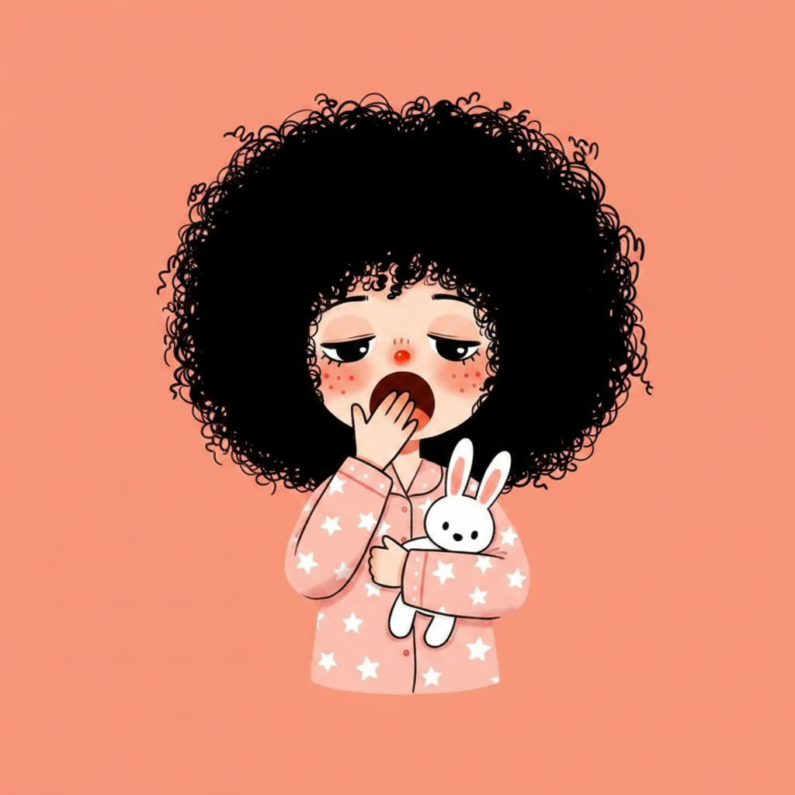
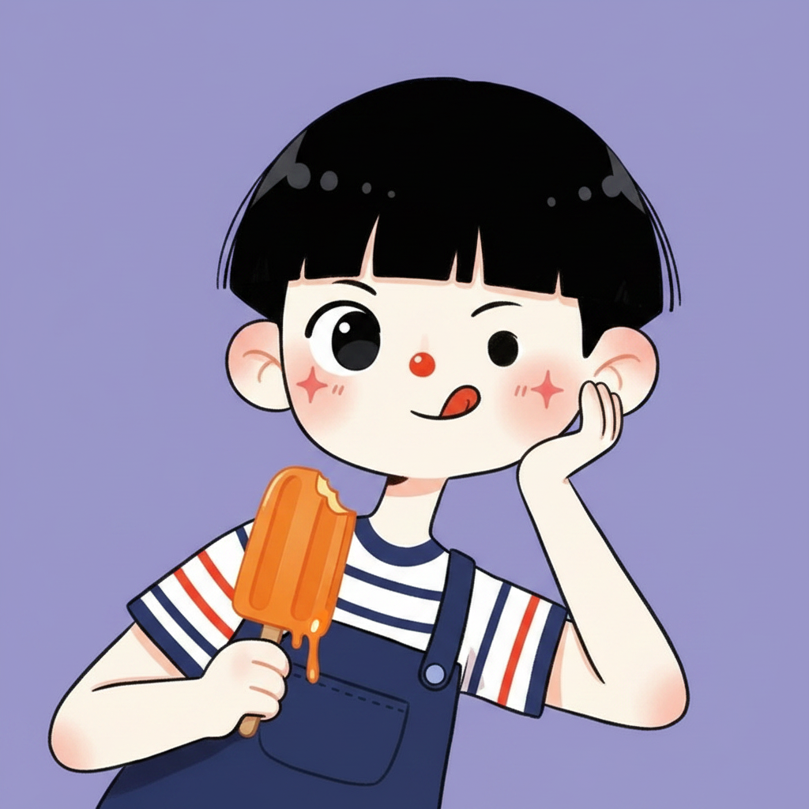
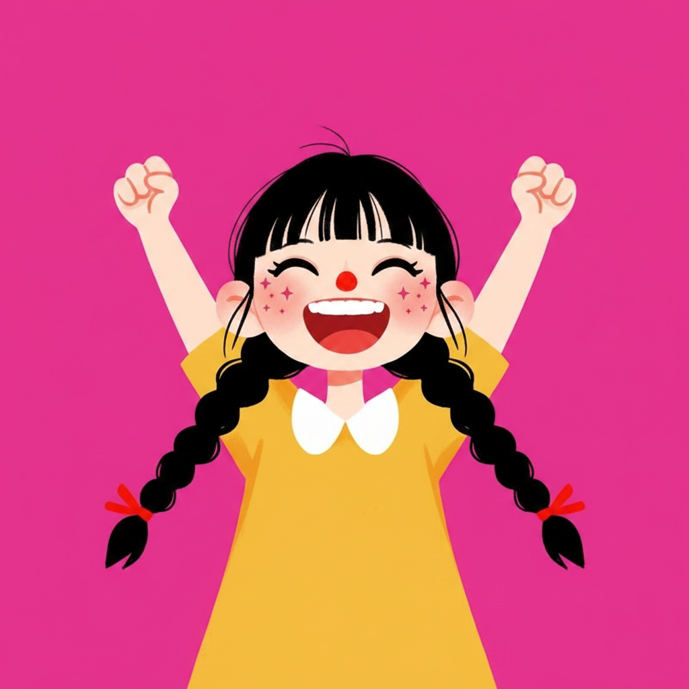
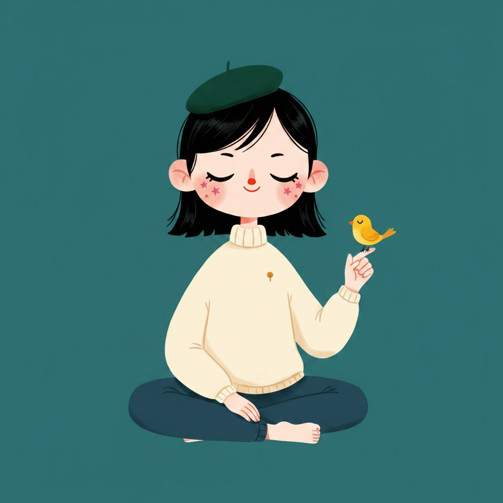

# /light-pop-portrait — locked light hand-drawn character portrait style

This style produces single-character portrait illustrations on a fully saturated solid color block. The *mood* is light and playful (chunky hair, big shiny eyes, star-sparkle blush, one expressive prop). The *format* is pop (one saturated solid color filling the canvas, ~5-color palette, no gradients). The line quality is **light** — thin, slightly wavy, hand-drawn — never thick or stamped.

Each invocation swaps a small set of dials. The locked frame (character anatomy, line quality, surface, background-as-block, star-sparkle blush) never moves.

## Prompt interpretation

The user will usually give a short brief — sometimes just an expression ("sleepy"), sometimes a pose plus a palette ("cheering arms up, magenta"), sometimes a near-complete mini-portrait ("zen androgynous kid with a beret holding a tiny bird, deep teal"). Translate that into a full portrait brief without stopping to ask:

1. **Pick an expression** — the emotional anchor of the piece (cheerful, sleepy, surprised, sly, laughing, zen, pouty, daydreaming, teary, embarrassed).
2. **Pick a hairstyle** from the catalogue (blunt bob + bangs, twin braids, fluffy afro curls, mushroom bowl cut, spiky bedhead, side-parted slick, high ponytail, double buns, side braid).
3. **Decide gender register** — girl, boy, or androgynous; always in the child-to-tween age range.
4. **Pick a pose** that fits the expression (head-and-shoulders, chest-up, leaning on hand, both hands up, hugging-prop, full-body seated, side profile).
5. **Pick one saturated background hue** — the single color filling the entire canvas behind the character.
6. **Optionally add headwear** (bucket hat, beret, hairband + bow, headband, glasses, none).
7. **Pick one signature prop** that the character interacts with (umbrella, popsicle, cherry, frog, bunny, bird, balloon, lantern, book, instrument).
8. **Pick the outfit register** (striped tee, overalls, sweater, pajamas, raincoat, sundress, hoodie).
9. **Honor the locked frame** — anatomy, line quality, flat fills, saturated background, star-sparkle blush — those never move.

Bias toward playful character moments where one expression + one prop carry the whole composition. Avoid crowded scenes, multiple characters, or heavy environmental staging — this style is a portrait, not a scene.

## Locked style axes (NEVER vary)

### Character anatomy

- **Single character per piece** — never a group, never a duo
- **Child-to-tween proportions** — large head relative to body, shoulders and chest fit comfortably in the frame
- **Round face shape** with a soft pointed chin; cheeks rounded but not exaggerated
- **Big round shiny eyes** — black filled pupils with a single small white glint per eye, thin black lashes above (never below)
- **Tiny round red nose** — a small red circle dot, centered between eyes and mouth, ~1/6 the size of an eye
- **Small expressive mouth** — a short curved line for closed smiles, a small rounded shape for open mouths; teeth shown only for big laughing grins
- **Hair is glossy chunky black** — solid black fill, never gradient, slight glossy highlight allowed as a thin lighter stroke on the crown
- **Hair always has a small flyaway strand or two** — one or two stray wisps sticking out from the silhouette to keep it from looking stamped

### Line quality

- **Thin delicate slightly-wavy black contour lines** — light hand-drawn feel, NOT thick, NOT bold, NOT uniformly stamped
- Lines have small natural irregularities — the contour breathes; perfect arcs feel wrong here
- No double-stroke, but minor variation in line weight along a single contour is welcome
- The whole canvas should read as if drawn by a confident but light hand

### Star-sparkle blush

- **Two pink five-point-star sparkles on the cheeks** — small five-point stars, ONE per cheek, sitting just under the eye
- **NEVER solid round dots** — this is the most commonly-failed locked detail; specify "five-point stars, not circles" if a model drifts
- Stars are a soft warm pink, slightly transparent or fully filled — never red, never saturated magenta

### Surface

- **Flat solid color fills only** — no gradients, no airbrush, no shading, no halftone, no riso grain, no paper texture
- The canvas is plastic-clean — no organic texture anywhere
- Subtle cel-shading is acceptable as a single flat shadow tone on the prop or under the hat brim, but is **optional**; most pieces are pure flat

### Background

- **One fully saturated single hue filling the entire canvas** — no gradient, no vignette, no second color band, no horizon strip, no border, no frame
- The character sits cleanly on top of the color block with no environment behind them
- Hue is one from the palette dial below

### Composition

- Square 1:1 canvas (1024×1024 recommended)
- Single portrait — the character is the only subject; the prop is held by or near the character, not staged independently
- Character occupies the center of the frame, head + shoulders to upper torso minimum, full body for `full-body seated`
- Clean negative space around the silhouette — the color block must breathe
- No text, no logos, no captions, no headlines

### Palette discipline

- **Limit ~5 total colors per piece** — background + hair-black + skin tone + 1-2 outfit colors + the prop's primary color
- Skin is a soft warm beige or peach, slightly desaturated; never bright orange, never pale white
- Hair is always solid black with optional one-stroke gloss

## Variable axes (the eight dials)

These are the only things that should change between pieces.

| # | Axis | What it controls | Example values |
|---|---|---|---|
| 1 | **Expression** | The emotional anchor | cheerful · sleepy/yawning · surprised "O" · sly wink · laughing (open grin) · zen closed-eye smile · pouty · daydreaming · teary · embarrassed |
| 2 | **Hairstyle** | Hair silhouette + cut | blunt bob + bangs · twin braids · fluffy afro curls · mushroom bowl cut · spiky bedhead · side-parted slick · high ponytail · double buns · side braid with bow |
| 3 | **Gender / Identity** | Gender register | girl · boy · androgynous (all in child–tween age range) |
| 4 | **Pose** | Body language | head-and-shoulders portrait · chest-up · leaning on hand · both hands up · hugging the prop · full-body seated · side profile |
| 5 | **Color palette** | The single saturated background hue | cobalt blue · mint green · peach coral · lavender purple · hot magenta · deep forest teal · mustard yellow · terracotta · dusty rose · navy |
| 6 | **Headwear** | What sits on the head (optional) | bucket hat · beret · hairband + bow · headband · round glasses · none |
| 7 | **Prop** | The one object the character interacts with | small umbrella · popsicle · cherry · frog · bunny · songbird · balloon · paper lantern · book · tiny instrument |
| 8 | **Outfit register** | Clothing baseline | striped tee · denim overalls · cozy sweater · pajamas · raincoat · sundress · hoodie |

## Brief template

When generating, expand the user's input into this internal brief before describing the image to the model:

```
Expression: <one phrase — what emotion the face carries>
Hairstyle: <cut + length + any small detail like a braid or bow>
Gender register: <girl / boy / androgynous, child–tween>
Pose: <verb + body language>
Background hue: <one saturated color filling the canvas>
Headwear: <bucket hat / beret / hairband / glasses / none>
Prop: <the one object held or near the character>
Outfit: <one or two layered pieces in a flat palette>
Color count: 5 max
```

## Worked examples

The anchor reference is a 2×2 grid of four girls in this style (see `ref-grid-anchor.png`). Below are six locked-style portraits, each holding the frame and varying the eight dials.

### Anchor — the 2×2 reference grid



Four character portraits in the canonical light hand-drawn flat-vector style: chunky black bobs and pigtails, big shiny eyes with thin lashes, tiny red noses, pink star-sparkle blush, color-blocked striped outfits, single small prop each (glasses, ponytail flick, beret + spider on a thread, cherry/pinwheel), saturated single-color blocks (red, blue, blue, orange).

### Example 1 — cheerful girl · yellow bucket hat · mushroom umbrella · cobalt



- Expression: cheerful, small upturned smile, big shiny eyes
- Hairstyle: blunt bob with bangs + one tiny side braid tied with a pink bow
- Gender: girl
- Pose: chest-up, holding the prop in front of her
- Background hue: cobalt blue
- Headwear: mustard-yellow bucket rain hat with a tiny white duck patch
- Prop: small red mushroom-shaped umbrella with curly handle
- Outfit: green-and-cream horizontal-striped collared shirt

### Example 2 — surprised boy · spiky bedhead · frog · mint



- Expression: surprised "O" mouth, eyebrows up
- Hairstyle: spiky messy bedhead, clumpy black tufts
- Gender: boy
- Pose: chest-up, both palms raised near the face in surprise
- Background hue: muted mint green
- Headwear: none
- Prop: tiny green frog perched on one palm
- Outfit: tomato-red short-sleeve tee

### Example 3 — sleepy girl · fluffy afro · stuffed bunny · peach



- Expression: sleepy half-lidded droopy eyes mid-yawn, one hand softly covering the mouth
- Hairstyle: big fluffy round black afro
- Gender: girl
- Pose: chest-up, hugging the prop against her
- Background hue: warm peach coral
- Headwear: none
- Prop: small white stuffed bunny held to her chest
- Outfit: pastel pink pajamas with tiny stars

### Example 4 — sly boy · mushroom bowl cut · popsicle · lavender



- Expression: sly smirking smile, one cheek pulled up
- Hairstyle: glossy mushroom bowl cut with blunt straight bangs
- Gender: boy
- Pose: chest-up leaning sideways with chin propped on one hand
- Background hue: lavender purple
- Headwear: none
- Prop: half-eaten orange popsicle dripping slightly
- Outfit: navy striped overall over a white tee

### Example 5 — laughing girl · twin braids · cheering · magenta



- Expression: huge joyful open laughing grin showing the top row of teeth, eyes squeezed into happy crescent curves
- Hairstyle: two very long thick black twin braids tied with red ribbons
- Gender: girl
- Pose: chest-up, both arms thrown up in a cheering pose with fists in the air
- Background hue: hot magenta pink
- Headwear: none
- Prop: implied (no physical prop — the celebration itself is the focus)
- Outfit: sunny yellow dress with a white collar

### Example 6 — zen androgynous kid · beret + bird · deep teal



- Expression: peaceful serene closed-eye zen smile
- Hairstyle: side-parted neat black hair
- Gender: androgynous
- Pose: full-body seated cross-legged, one hand raised
- Background hue: deep forest teal
- Headwear: small dark green beret tilted on top of the head
- Prop: tiny yellow songbird perched on the index finger
- Outfit: cream turtleneck with a tiny gold pin

## Anti-patterns

- ❌ Solid round dots for blush — must be **five-point pink stars**, this is the most commonly-failed detail
- ❌ Thick, bold, stamped, or uniform-weight outlines — must be thin, delicate, slightly wavy
- ❌ Multiple characters in the foreground — one character per piece, always
- ❌ Gradient background, vignette, second color band, scenery photo — the field must be a single flat saturated hue
- ❌ Photorealism, 3D modeling, soft airbrush, halftone, riso grain, paper texture, pencil shading — flat only
- ❌ Crowded composition with no negative space — the color block must breathe around the character
- ❌ Headlines, captions, in-image text, or logos — never any baked-in typography
- ❌ Adult proportions — the character is always in the child-to-tween age range
- ❌ Open mouths with full teeth detail unless the expression is a big laughing grin
- ❌ Stamped, perfectly symmetric hair silhouettes — there should always be one or two small flyaway strands

## Output evaluation checklist

Before declaring a piece done, verify:

- [ ] A single character is present in child-to-tween register
- [ ] Hair is glossy solid black with at least one small flyaway strand
- [ ] Big round shiny eyes with a single white glint each, tiny round red nose, expressive mouth
- [ ] Pink **five-point star** sparkle blush on each cheek (NOT solid dots)
- [ ] Thin delicate slightly-wavy black contour lines, hand-drawn feel
- [ ] Background is one fully saturated solid color filling the canvas edge-to-edge
- [ ] Flat solid fills only — no gradients, no texture, no shading
- [ ] One signature prop interacts with the character; no second character
- [ ] Color count stays at roughly five total
- [ ] No text, no logos, no captions in the image
- [ ] Composition has breathable negative space around the silhouette

## Portability note

This style is described at the semantic level — *what the image must look like*, not which model produces it. It generates cleanly on broad-distribution image models when given the anchor reference plus the brief expansion above. Models with strong character-anatomy coherence (nano-banana edit, GPT-Image-2 with reference, Seedream 5) tend to preserve the star-sparkle blush and the light line quality most reliably. If a model drifts the blush into solid pink dots, repeat the constraint twice in the prompt ("**five-point star sparkles, not solid dots**"). If a model drifts the line weight thicker, repeat "thin delicate slightly-wavy hand-drawn lines, NOT thick or stamped" near the end of the brief.
