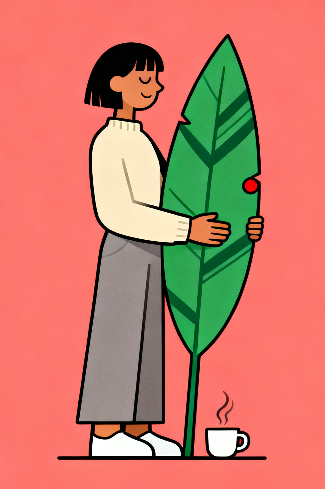
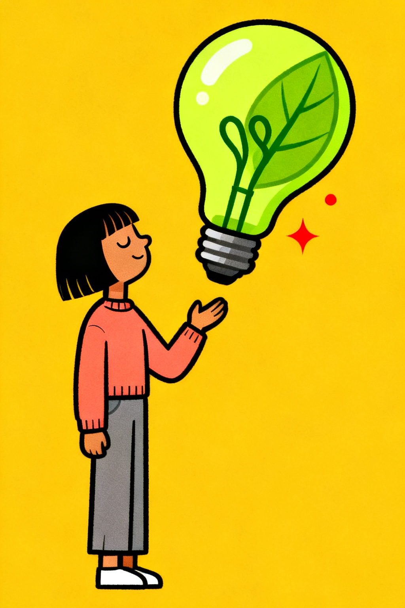
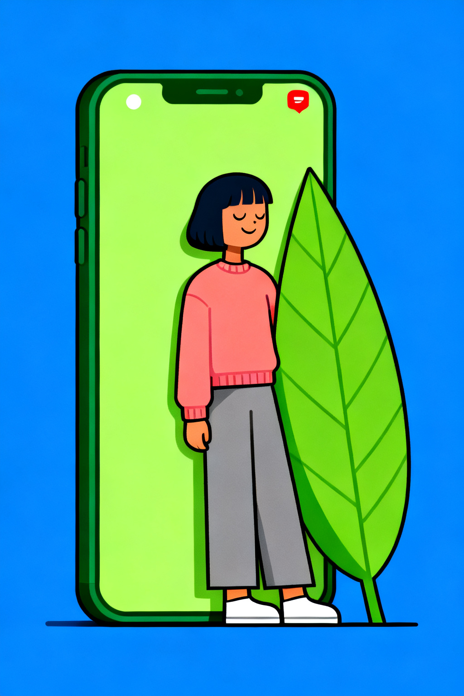
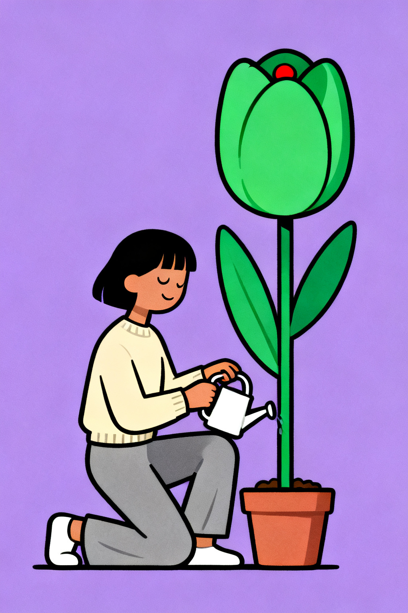
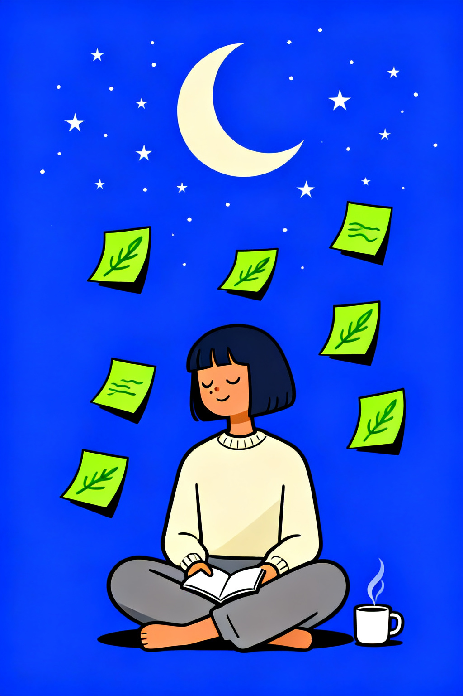
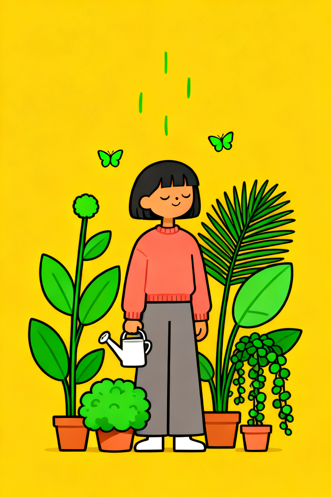
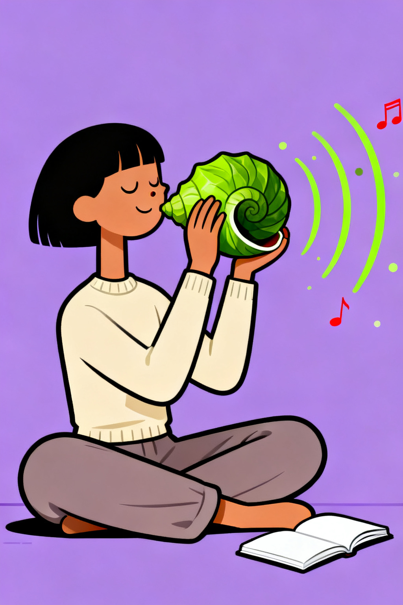
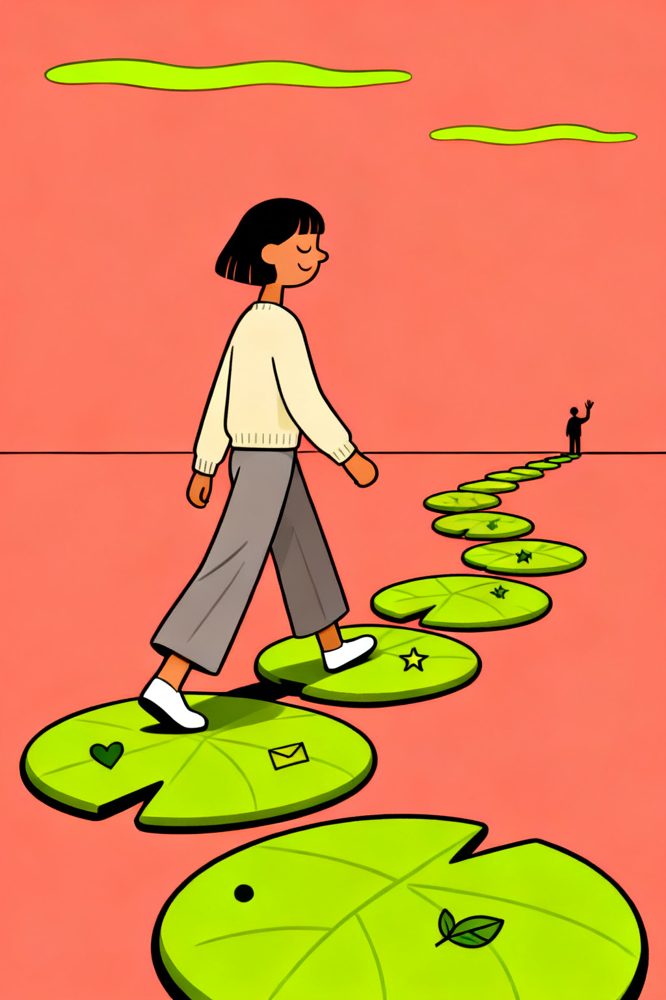

# /mellow-pop — locked chill editorial poster style

This style produces serene, scene-driven flat-vector editorial posters. The *mood* is mellow (closed-eye smile, soft posture, contemplative scene). The *format* is pop (one saturated solid color filling the canvas + a signature leaf-green accent). The same recurring character anchors every piece so a series reads as one collection.

Each invocation swaps a small set of dials — the locked frame (character, line quality, surface, background-as-block, green-pop signature) never moves.

## Prompt interpretation

The user will usually give a short brief — sometimes just a metaphor ("a giant lightbulb"), sometimes a metaphor plus a palette ("watering a green tulip, lavender"), sometimes a full mini-scene ("late-night planning, indigo, L3 with sticky notes and a crescent moon"). Translate that into a full poster brief without stopping to ask:

1. **Pick a scene metaphor** that visualizes the brief's concept. If the user gave only a feeling-word, choose the most evocative everyday-but-oversized object or vignette for that feeling.
2. **Pick one saturated background hue** that supports the scene's mood. One color, no gradient.
3. **Pick a complexity level (L1 / L2 / L3)** appropriate to the request — L1 for a single hero prop, L2 for prop + 1–2 supporting elements, L3 for a multi-element mini-scene with horizon, path, or ambient depth.
4. **Choose a character pose** that fits the scene (sitting cross-legged, walking, kneeling, reaching, leaning, holding).
5. **Pick an outfit accent** — cream sweater (calmer, default) or coral-pink sweater (warmer, energetic). Pants and shoes are locked.
6. **Honor the locked frame** — character anatomy, line quality, flat fills, saturated background, leaf-green pop signature — those never move.

Bias toward scenes where an everyday object is gently oversized (a giant book, a giant lightbulb, a giant flower) or where a quiet moment is staged with ambient props (sticky notes drifting, butterflies, soundwave arcs). Avoid hard action, conflict, or surprise — the character is always contemplative.

## Locked style axes (NEVER vary)

### Character (the recurring protagonist)

- **Tall slender proportions, small head** — elongated silhouette in a modern editorial way
- **Smooth tan skin** — flat fill, no rendering
- **Short dark bobbed hair with straight bangs** — chin-length, slightly tucked, solid black fill
- **Three-quarter face view** — slightly turned toward camera, never full profile, never full front
- **Closed-eye smile** drawn as two short curved lines (eyes never open)
- **A tiny visible nose bump** on the silhouette — small short curve between eye and mouth (do not omit)
- **Soft smile mouth** — single short curved line, never showing teeth
- **Wardrobe**: long-sleeve sweater (cream OR coral-pink) + warm-gray loose pants + simple white shoes — never deviate from this base
- **Mood is always mellow** — chill, contemplative, soft posture, slight forward tilt of the head; never excited, surprised, or strained

### Line quality

- **Thin clean uniform black outlines** around every shape — medium weight, decisive, never sketchy, never chunky
- No double-stroke, no varying line-width within a single shape's perimeter, no hand-drawn wobble
- Line weight is consistent across the whole canvas

### Surface

- **Flat solid color fills only** — no gradients, no airbrush, no shading, no halftone, no riso grain, no paper texture
- Cel-shading is acceptable as a single flat shadow tone on the character or hero prop, but is *optional* — most pieces are pure flat
- The canvas is plastic-clean — no organic texture anywhere

### Background

- **One fully saturated single hue filling the entire canvas** — no gradient, no vignette, no second color band, no horizon strip
- No white margins, no border, no frame, no clipping mask
- Hue is one from the palette dial below

### Green-pop signature

- **A pop of bright leaf-green must appear in every piece** — never a different green, never desaturated, never minty unless mint is the background and the pop is rendered as a darker leaf-green
- The green appears as: the oversized hero prop · accent plants/leaves · ambient motifs (sticky notes, soundwaves, butterflies) · or the character's sweater (rare)
- Darker-green internal details (vein lines, screen frame, page lines, spiral ridges) read against the bright leaf-green fill

### Optional accents

- **Tiny red dot accents** — wax seal on an envelope, music note, notification badge, bookmark ribbon, sparkle dot. One or two per piece, never more.
- **Small white companion props** — coffee mug with a single steam curl, watering can, open notebook/journal. These give the scene lived-in detail without crowding it.

### Composition

- Portrait canvas, 1024×1536 (2:3) recommended
- Character occupies the lower-center to mid-frame; the hero prop or supporting elements anchor the upper half (L1) or wrap around the character (L2/L3)
- Clean negative space between elements — never crowded
- No text, no logos, no captions, no headlines

## Variable axes (the five dials)

These are the only things that should change between pieces.

| # | Axis | What it controls | Example values |
|---|---|---|---|
| 1 | **Palette** | The single saturated background hue | warm coral-pink · buttery yellow · soft mint-green · periwinkle blue · soft lavender · deep indigo-blue · warm peach |
| 2 | **Scene metaphor** | The concept the scene visualizes | giant envelope (message) · giant lightbulb (idea) · giant open book (learning) · giant phone (social) · tulip + watering can (growth) · sticky notes + moon (planning) · garden + butterflies (cultivation) · giant spiral shell + soundwaves (listening) · lily-pad stepping stones + distant figure (journey) |
| 3 | **Complexity** | How rich the scene is | **L1** — character + one oversized green prop, clean negative space · **L2** — prop + 1–2 supporting elements (coffee cup, journal, bookmark, butterflies) · **L3** — multi-element mini-scene with ambient depth (horizon, path, distant figure, 4+ floating props) |
| 4 | **Pose** | Character body language | sitting cross-legged · standing · walking in mid-stride · kneeling on one knee · leaning casually · reaching upward · holding the prop · sitting on top of the prop |
| 5 | **Outfit accent** | The sweater color (other wardrobe items locked) | cream (calmer, default) · coral-pink (warmer, energetic) |

## Brief template

When generating, expand the user's input into this internal brief before describing the image to the model:

```
Scene metaphor: <one phrase — what the scene depicts and what it stands for>
Palette: <single saturated background hue>
Complexity: L1 / L2 / L3
Pose: <verb + posture>
Outfit accent: cream / coral-pink
Green-pop role: <hero prop / supporting plants / motifs / character sweater>
Ambient props (L2/L3 only): <coffee mug · journal · butterflies · sticky notes · soundwave arcs · stars · moon · clouds · stepping stones · distant figure>
Optional red accent: <wax seal · music note · notification dot · bookmark · sparkle>
```

## Worked examples

Nine reference pieces below — each holds the locked frame and varies the five dials.

### Example 1 — coral · giant green leaf hug · L1 (anchor piece)



- Palette: warm coral-pink
- Scene: character calmly hugging an oversized leaf-green leaf taller than she is, in three-quarter view
- Complexity: L1 (one hero prop + a tiny red wax-seal accent + a small white coffee cup at her feet)
- Pose: standing, both arms wrapping the giant leaf
- Outfit accent: cream sweater
- Green-pop role: the giant leaf (with darker-green vein lines)

### Example 2 — buttery yellow · giant green lightbulb · L1 (idea / inspiration)



- Palette: buttery yellow
- Scene: character looking up and reaching toward a giant bright leaf-green lightbulb floating beside her head; small red sparkle dot at the side
- Complexity: L1
- Pose: standing, one hand reaching upward
- Outfit accent: coral-pink sweater
- Green-pop role: the giant lightbulb (with a darker-green filament squiggle inside)

### Example 3 — soft mint · giant green open book · L2 (reading / learning)


- Palette: soft mint-green
- Scene: character sitting cross-legged reading a giant green open book balanced on her lap, with a tiny red bookmark ribbon, and a small white coffee mug with one steam curl beside her
- Complexity: L2 (hero prop + bookmark + coffee mug)
- Pose: sitting cross-legged
- Outfit accent: cream sweater
- Green-pop role: the giant book (with darker-green page lines)

### Example 4 — periwinkle blue · giant green phone · L1 (social / communication)



- Palette: periwinkle blue
- Scene: character standing leaning casually against a giant bright leaf-green smartphone propped vertically, with a small red notification badge in the upper corner of the screen
- Complexity: L1
- Pose: standing, leaning against the phone
- Outfit accent: coral-pink sweater
- Green-pop role: the giant phone (with darker-green screen frame and white speaker dot)

### Example 5 — soft lavender · giant green tulip + watering can · L2 (growth / nurture)



- Palette: soft lavender
- Scene: character kneeling on one knee tending a giant bright leaf-green tulip flower growing from a small terracotta pot, holding a tiny white watering can; a small red dot at the center of the bloom
- Complexity: L2 (hero plant + terracotta pot + watering can)
- Pose: kneeling on one knee
- Outfit accent: cream sweater
- Green-pop role: the giant tulip (with darker-green stem and leaves)

### Example 6 — deep indigo · sticky notes + crescent moon · L3 (late-night planning)



- Palette: deep indigo-blue
- Scene: character sitting cross-legged on the floor with an open notebook on her lap, seven small bright leaf-green sticky-note rectangles tilted at various angles floating around her, a large pale-cream crescent moon and scattered tiny white star dots overhead, and a small white coffee mug beside her
- Complexity: L3 (multi-element scene: floating sticky notes + moon + stars + notebook + coffee mug)
- Pose: sitting cross-legged
- Outfit accent: cream sweater
- Green-pop role: the floating sticky notes (with darker-green handwriting squiggles)

### Example 7 — buttery yellow · garden of oversized plants + butterflies · L3 (cultivation)



- Palette: buttery yellow
- Scene: character standing centered among four oversized bright leaf-green plants in terracotta pots at varying heights (tall stalk with a round bloom, wide leafy bush, drooping vine, tall fan-shaped palm leaf), holding a small white watering can; three tiny green butterflies and thin green petal marks drift above
- Complexity: L3 (4+ plants + butterflies + falling petals + watering can)
- Pose: standing in the center, watering can in one hand
- Outfit accent: coral-pink sweater
- Green-pop role: the cluster of plants (varied silhouettes, all in leaf-green)

### Example 8 — soft lavender · giant spiral shell + soundwaves · L3 (listening / tuning in)



- Palette: soft lavender
- Scene: character sitting cross-legged on the floor holding an oversized bright leaf-green spiral seashell up to one ear with both hands; three thin curved bright-green sound-wave arcs ripple outward from the shell's mouth, plus tiny floating dots and a small red music note in the air; a small open white journal lies beside her on the ground
- Complexity: L3 (shell + soundwave arcs + floating dots + music note + journal)
- Pose: sitting cross-legged, both hands holding the shell to ear
- Outfit accent: cream sweater
- Green-pop role: the giant shell (with darker-green spiral ridges) + the soundwave arcs

### Example 9 — coral · lily-pad stepping-stone path + distant figure · L3 (journey / connection)



- Palette: warm coral-pink
- Scene: character walking in mid-stride along a winding path made of five oversized bright leaf-green rounded stepping stones curving from the foreground into the distance, each stone carries a tiny darker-green motif (heart, star, envelope, leaf, dot); at the path's end in the far distance stands a small silhouette of a second figure waving; two thin bright-green cloud-shape curves drift across the sky
- Complexity: L3 (5 stepping stones with motifs + horizon line + distant figure + cloud curves)
- Pose: walking in mid-stride
- Outfit accent: cream sweater
- Green-pop role: the stepping stones (with darker-green motifs inscribed on each) + the cloud curves

## Anti-patterns

- ❌ A different character — must be the recurring tan-skin / bobbed-hair / closed-eye-smile protagonist
- ❌ Open eyes, gaze toward camera, or any expression other than the closed-eye soft smile
- ❌ Missing the tiny nose bump on the silhouette (the model often drops it — call it out explicitly)
- ❌ Multiple characters in the foreground — a second figure may appear in the far distance as a small silhouette only (Example 9)
- ❌ Gradient background, vignette, second color band, scenery photo, or non-saturated bg — the field must be a single flat saturated hue filling the canvas
- ❌ No leaf-green anywhere — the green-pop signature must appear in every piece
- ❌ A different green (lime, forest, olive, mint as the pop color) — must be bright leaf-green
- ❌ Photorealism, 3D modeling, soft airbrush, halftone, riso grain, paper texture, or pencil shading
- ❌ Chunky / sketchy / variable-weight outlines — must be thin clean uniform black
- ❌ Crowded composition with no negative space — the canvas should always breathe
- ❌ Headlines, captions, in-image text, or logos — never any baked-in typography
- ❌ Excited, surprised, strained, or sad expressions — mood is always mellow contemplation
- ❌ Action verbs that imply force (running, jumping, climbing aggressively) — the character moves softly

## Output evaluation checklist

Before declaring a piece done, verify:

- [ ] The recurring character is present with tall slender proportions, short dark bobbed hair with bangs, three-quarter view, closed-eye smile (two short curved lines), AND a tiny visible nose bump on the silhouette
- [ ] Wardrobe: long-sleeve sweater (cream or coral-pink) + warm-gray loose pants + simple white shoes — no deviation
- [ ] Background is one fully saturated solid color filling the canvas edge-to-edge
- [ ] A pop of bright leaf-green appears somewhere in the composition
- [ ] Thin clean uniform black outlines on every shape, flat solid fills only
- [ ] No gradients, no shading, no texture, no grain anywhere
- [ ] No text, no logos, no captions in the image
- [ ] Composition has breathable negative space
- [ ] Mood reads as mellow / contemplative

## Portability note

This style is described at the semantic level — *what the image must look like*, not which model produces it. It generates cleanly on broad-distribution image models (Seedream 5, GPT-Image-2, Flux, Qwen-Image). Models with stronger character-anatomy coherence (Seedream 5 at 1024×1536 portrait) tend to preserve the recurring face most reliably; if a model drifts the character into a generic person, repeat the character description block twice in the prompt (once near the top, once near the end with "do not omit the nose"). If a model insists on adding gradient shine to a glass prop (lightbulb, phone screen), explicitly forbid gradient inside the prop and require pure flat solid fill.
