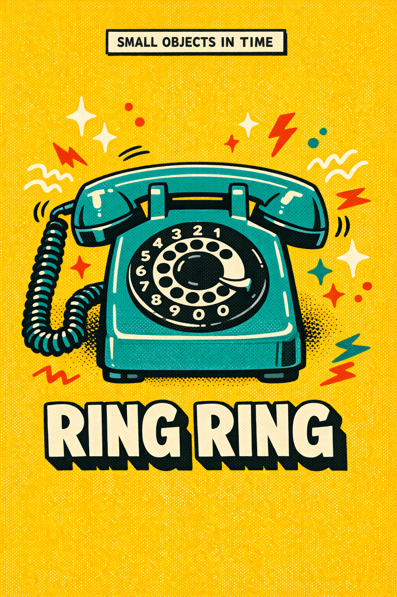
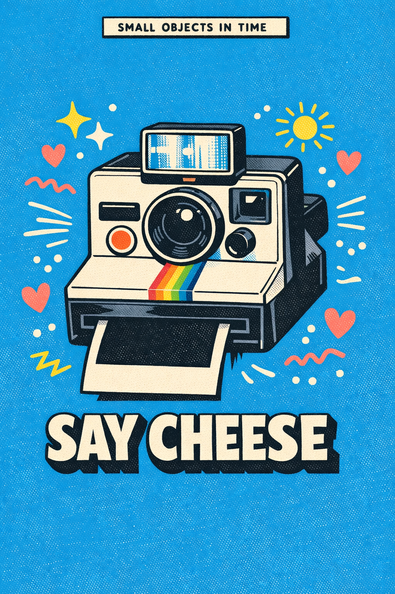
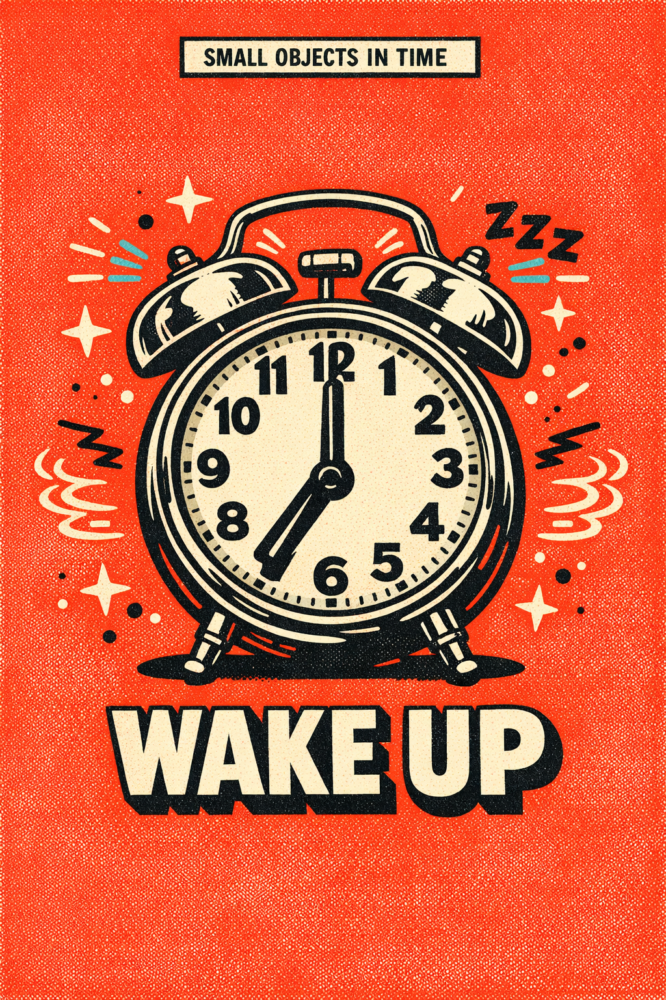
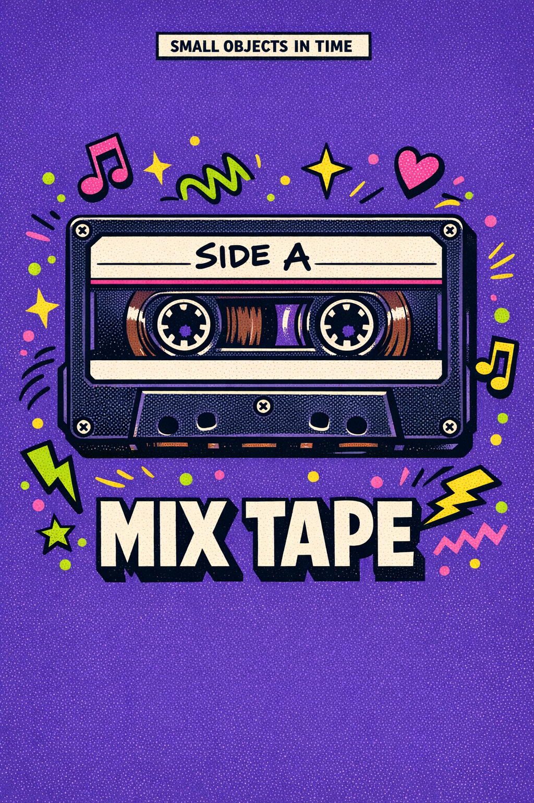

# /riso-relic — locked retro-relic risograph poster style

This skill produces single-object pop-art posters in the riso-relic house style: one nostalgic everyday object sitting dead-center on a saturated single-hue field, framed by a tiny "SMALL OBJECTS IN TIME" banner at the top and a chunky retro headline at the bottom, with hand-drawn doodle accents floating around the hero. Think mid-century sticker-pack meets risograph print zine — flat, tactile, and a little bit grainy.

Each invocation swaps only a handful of dials — every other style axis stays locked.

## Prompt interpretation

The user will usually give a short brief — sometimes just an object ("rotary phone"), sometimes an object plus a vibe ("walkman, 80s mall energy"). Your job is to turn that into a full poster brief without stopping to ask:

1. **Pick a hero object** from the brief. If the user only gave a vibe, pick the most evocative everyday relic for that vibe.
2. **Choose a saturated background hue** that matches the object's era + mood. One color, no gradient.
3. **Pick an accent palette** of 2–3 colors that pop against the background — these carry the doodles and the headline fill.
4. **Write a 1–3 word headline** in chunky all-caps that captures the *feeling* the object gives off (e.g. RING RING, MIX TAPE, PLAY LOUD, SAY CHEESE).
5. **Pick a doodle vocabulary** — which little hand-drawn marks float around the hero (sparkles, squiggles, dots, music notes, lightning, motion lines, hearts, sound-waves, ZZZs…). Pull from the object's emotional world.
6. **Hold the locked frame** — banner, drop-shadow, grain, black outlines, centered composition — those never move.

Bias toward objects with high tactile nostalgia: things people *held*, *pressed*, *wound*, or *carried*. Avoid abstract concepts; avoid logos; avoid people.

## Locked style axes (NEVER vary)

### Composition

- **Single hero object, centered, dead-symmetric** — the object owns the visual center of mass
- Portrait canvas (recommended 1024×1536)
- Headline reads at the bottom; small banner reads at the top; hero sits between them
- No backgrounds, no scenery, no horizon line — the object floats on the color field

### Line quality

- Bold **black ink outlines** on every shape, slightly imperfect like a hand-inked stencil
- **Simple cel-shading** — one or two flat shadow tones per object, never airbrushed
- No gradients, no 3D rendering, no soft modeling — flat vector with weight

### Surface

- **Riso / halftone grain overlay** across the whole canvas — visible noise, tactile print feel
- Slight ink-misregistration vibe acceptable (one accent color nudged a pixel or two)
- The grain is the only texture — no other photo textures, no fabric, no paper-curl

### Background

- **One saturated hue filling the entire canvas** — no gradient, no vignette, no second color band
- Hue is one of: hot magenta, mustard yellow, sky blue, tomato red, deep violet, kelly green, cobalt, burnt orange, chartreuse, blush pink (or a sibling)

### Top banner

- Small **white rectangular banner** with thin black border, centered horizontally near the top edge
- Contains small all-caps text — default copy: **"SMALL OBJECTS IN TIME"**
- Simple sans-serif, tracked-out slightly, never decorative

### Headline (bottom)

- **Chunky retro display face**, all-caps, thick condensed letters — 70s/80s poster vibe
- Fill is **cream-white** (not pure white) with a **solid offset black drop-shadow** behind it
- 1–3 words; never a full sentence

### Doodle accents

- Floating around the hero, never overlapping its silhouette
- Drawn in the same hand-inked weight as the hero, in the accent palette
- Vocabulary: sparkle stars (✦/✧), squiggly motion lines, scattered dots, tiny lightning bolts, music notes, hearts, sun rays, sound-wave arcs, zigzags, "ZZZ" squiggles, small triangles
- 6–12 accent marks total — sparse enough to breathe, dense enough to feel alive

## Variable axes (the five dials)

These are the only things that should change between pieces.

| # | Axis | What it controls | Example values |
|---|---|---|---|
| 1 | **Hero object** | The nostalgic everyday relic that owns the canvas | rotary phone · boombox · Polaroid · alarm clock · cassette · Walkman · Game Boy · lava lamp · Zippo · roller skate · soda bottle · ticket stub · CRT TV · lipstick · disposable camera |
| 2 | **Background hue** | The single saturated color filling the canvas | hot magenta · mustard yellow · sky blue · tomato red · deep violet · kelly green · cobalt · burnt orange · chartreuse · blush pink |
| 3 | **Accent palette** | 2–3 contrast colors for the doodles + headline fill highlights | cream + teal + red · lime + hot-pink + yellow · white + coral + lemon · cream + cyan + black |
| 4 | **Headline copy** | 1–3 chunky all-caps words tied to the object's feeling | PLAY LOUD · RING RING · SAY CHEESE · WAKE UP · MIX TAPE · STAY TUNED · FIZZ POP · INSTANT |
| 5 | **Era / mood** | The decade or feeling-tone the piece evokes; drives object choice and doodle vocabulary | 50s diner · 60s domestic · 70s vacation · 80s mall · 90s arcade · atomic age · mid-century kitchen |

## Brief template

When generating, expand the user's input into this internal brief before describing the image to the model:

```
Hero object: <one specific named object, with era>
Background: <single saturated hue>
Accents: <2–3 colors>
Headline: <1–3 words, all caps>
Banner: SMALL OBJECTS IN TIME  (override only if user explicitly asks)
Mood: <one phrase>
Doodle vocabulary: <4–6 marks pulled from the object's world>
```

## Worked examples

Five reference pieces below — each holds the locked frame and varies the five dials.

### Example 1 — boombox · hot magenta · "PLAY LOUD" (80s mall energy)


- Hero: chunky 1980s stereo cassette boombox, two big speakers, antenna up
- Background: hot magenta
- Accents: cream + lime green + yellow
- Doodles: sparkle stars, music notes, lightning bolts, scattered dots
- Headline: PLAY LOUD

### Example 2 — rotary phone · mustard yellow · "RING RING" (60s domestic)



- Hero: 1960s rotary dial telephone, curly cord, finger dial
- Background: mustard yellow
- Accents: cream + tomato red + teal
- Doodles: sound-wave arcs near handset, zigzags, sparkles, scattered dots, lightning
- Headline: RING RING

### Example 3 — Polaroid · sky blue · "SAY CHEESE" (70s vacation)



- Hero: boxy Polaroid-style instant camera, rainbow stripe, blank photo ejecting
- Background: sky blue
- Accents: white + coral pink + lemon yellow
- Doodles: tiny sun, hearts, zigzags, motion lines, sparkles
- Headline: SAY CHEESE

### Example 4 — twin-bell alarm clock · tomato red · "WAKE UP" (morning rush)



- Hero: vintage twin-bell mechanical alarm clock, hands at 7:00
- Background: tomato red
- Accents: cream + cyan + black
- Doodles: sound-wave arcs around the bells, "ZZZ" squiggles, sparkles, dots
- Headline: WAKE UP

### Example 5 — cassette tape · deep violet · "MIX TAPE" (80s nostalgia)



- Hero: 80s compact cassette, visible spools, hand-scrawled "SIDE A" label
- Background: deep violet
- Accents: lime green + hot pink + yellow
- Doodles: music notes, hearts, lightning, sparkles, zigzags
- Headline: MIX TAPE

## Anti-patterns

- ❌ Two or more hero objects — the frame is a *one-object* poster; never a still-life
- ❌ A scene background (a desk, a wall, a horizon) — the field must be a single flat color
- ❌ Gradient background, vignette, or a second color band — flat saturated hue only
- ❌ Photorealism, 3D modeling, soft airbrushed shading — must read as flat vector + grain
- ❌ Doodle accents overlapping the hero — they orbit, they never collide
- ❌ Headline in a thin / modern / serif face — must be chunky retro display
- ❌ Headline without the offset black drop-shadow
- ❌ More than ~12 accent marks — the canvas should still breathe
- ❌ Headline that is a full sentence — keep to 1–3 punchy words
- ❌ Modern / digital objects (smartphones, AirPods, laptops) — defeats the "relic" feel
- ❌ Adding a human face or figure — the object is the only protagonist

## Output evaluation checklist

Before declaring a piece done, verify:

- [ ] Exactly one hero object, centered, dead-symmetric
- [ ] Saturated single-hue background fills the entire canvas
- [ ] Top banner present with "SMALL OBJECTS IN TIME" (or user-specified copy)
- [ ] Bottom headline in chunky retro all-caps with offset black drop-shadow
- [ ] 6–12 doodle accents in the accent palette, floating, not overlapping the hero
- [ ] Visible halftone / riso grain across the canvas
- [ ] Bold black ink outlines on hero and all accents
- [ ] No gradients, no photoreal textures, no second background color, no scenery

## Portability note

This style is designed to be model-agnostic at the semantic level — the spec describes *what the image must look like*, not which model produces it. It generates cleanly on broad-distribution image models (GPT-Image-1.5, Flux, Qwen-Image, Seedream). Higher-fidelity poster faces (clean type, accurate halftone) are easier on GPT-Image-1.5 at `high` quality and 1024×1536 portrait size. If a model struggles with the inline banner text, allow the banner to render as a small clean rectangle and overlay the "SMALL OBJECTS IN TIME" copy in post — the rest of the style should still hold.
