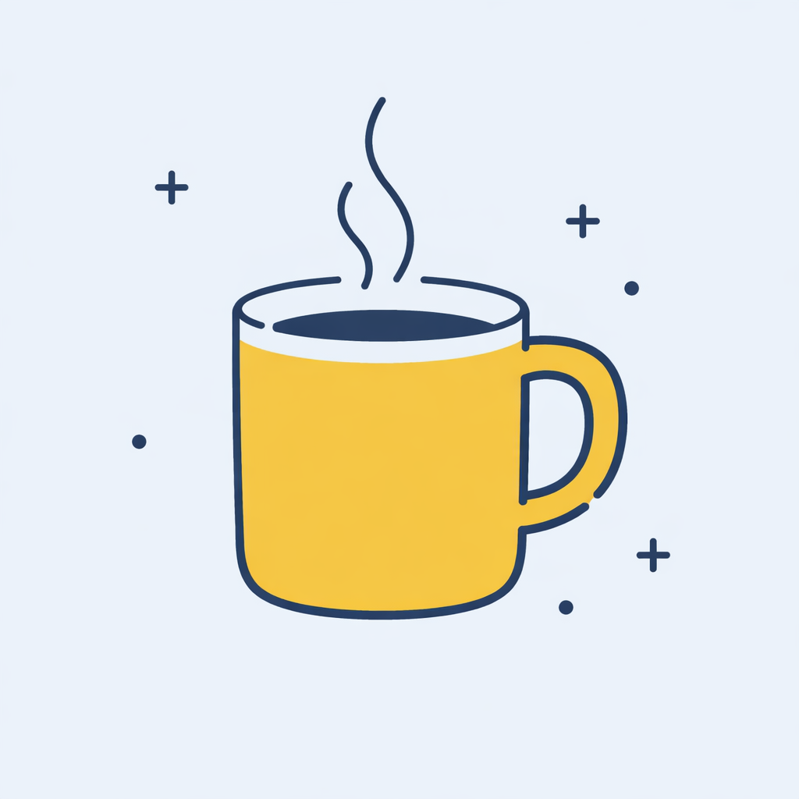
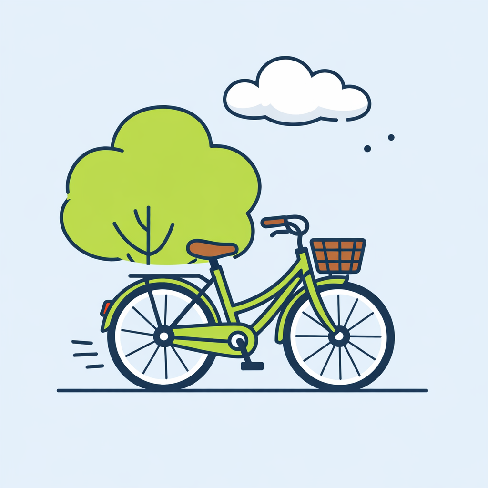

# /soft-vector — locked airy flat-vector spot illustration style

Friendly, calm, "modern UI onboarding" spot illustrations. Every piece holds the same locked frame: a soft pale-blue square canvas, delicate dark-navy linework, flat color fills, and one muted accent hue. The signature lift comes from intentionally **open / unclosed outlines** — small visible gaps in rims, handles, ground lines, cloud silhouettes — that keep the artwork feeling hand-drawn rather than mechanical.

Think Storyset / Lottiefiles airy spot art with the airiness pushed harder by the open-line rule.

## Prompt interpretation

The user will usually give a short brief — sometimes just a concept ("morning routine"), sometimes concept + palette ("empty inbox in violet"), sometimes concept + complexity ("focus mode, L3"). Your job is to turn that brief into a complete spot illustration spec without pausing for clarification:

1. **Pick a hero subject** from the brief — a single theme-native object that visually carries the concept. One mug for morning, one mailbox for inbox, one lamp + book + plant for focus. The scene IS the metaphor — never default to generic filing-cabinet + megaphone.
2. **Pick a complexity level** (L1 / L2 / L3) based on how rich the brief is.
3. **Pick a palette accent** that matches the subject's mood (see palette options below).
4. **Pick an accent-mark motif** — dots, plus signs, sparkles, or motion ticks — that fits the subject's emotional world.
5. **Pick 2–3 specific open-line callouts** for the chosen subject. These vary by subject: mug rim gap, handle that doesn't close, ground line that ends in mid-air, cloud silhouette break, lamp arm fade, pot rim gap, etc.

Bias toward subjects that are concrete and iconic — things you can name in one or two words.

## Locked style axes (NEVER vary)

### Canvas
- **Square 1:1**, recommended 1024×1024
- A single **flat pale-blue field** fills the entire canvas — `#EEF1F5`
- No gradient, no border, no horizon, no texture

### Line quality
- **Thin dark-navy outlines, ~1.5–2px** at 1024-wide canvas (delicate, NOT chunky)
- One uniform stroke colour everywhere (a single deep navy, ~`#1F2A44`)
- Uniform stroke weight on each shape — no calligraphic taper, no pencil scratch
- **Rounded line caps** (no flat or square caps)

### Open outlines (the signature)
- Every piece must include several intentionally **unclosed** outlines. Examples by subject:
  - Mugs / cups → rim has a small visible gap; handle does not return to the body; steam wisps end as free-floating lines
  - Vehicles → ground line ends in mid-air on both sides; one body panel doesn't fully close
  - Buildings → roof eaves run past the wall; door jamb doesn't reach the floor
  - Plants → pot rim has a tiny gap; one leaf outline breaks at the tip
  - Clouds / tree blobs → one or two small visible breaks in the silhouette
  - Devices → speech-bubble lines are floating ticks, not closed pills
- This open-line treatment is **non-optional** — it is what distinguishes Soft Vector from generic flat illustration. Always name the specific open-line spots when briefing a model.

### Fill
- **Strictly flat colour** — no gradients, no shading, no ambient occlusion, no inner highlights, no halftone
- One lead accent hue (the chosen palette dial), plus always-available neutrals: soft grey-white `#F4F5F1` and the dark-navy stroke `#1F2A44`
- One optional secondary accent is permitted on L3 vignettes (e.g., warm-orange book cover inside a violet-led desk scene)

### Subject placement
- **Centered**, occupying ~60–75% of the canvas
- Generous breathing room around the subject — pieces never fill edge-to-edge

### Micro-marks
- Scattered decorative marks drawn in the same thin navy stroke
- Vocabulary: tiny dots, small plus signs, four-point sparkles, short motion ticks
- 4–8 marks total — sparse but alive
- Pick **one** motif per piece (a few dots can mix with anything)

### What is NOT in the canvas
- No text, no caption, no headline, no wordmark, no logo, no UI chrome
- No full human figures, no faces
  - Humans appear at most as a silhouette behind glass or a partial hand
- No second illustration, no border, no patterned background

## Variable axes (the dials)

These are the only things that should change between pieces.

| # | Dial | What it controls | Options |
|---|---|---|---|
| 1 | **Palette accent** | The single muted hue leading the piece | mustard `#E8B53A` · lime-sage `#A8C95A` · warm-orange `#E87A3A` · violet `#7B6FE0` |
| 2 | **Scene metaphor** | The hero subject + any environment props | coffee mug for morning · bicycle for commute · lamp + book for focus · phone + bell for ping · mailbox for inbox · envelope + note for messages, etc. — always theme-native |
| 3 | **Complexity** | How many props share the canvas | L1 single object hero · L2 object + 1–2 environment props · L3 vignette with 3–5 props composing a scene |
| 4 | **Cast** | Optional human element | none · silhouette-behind-glass · partial hand (never full figures, never faces) |
| 5 | **Accent marks** | The micro-mark motif | dots · plus signs · sparkles · motion ticks |
| 6 | **Action / mood** | Energy in the scene | static · gesture (wave, tilt) · in-motion (rolling wheel, ringing bell) |

### Palette mood pairing hints
- Mustard → warm, welcoming, morning, food / drink, mail
- Lime-sage → outdoor, commute, nature, growth
- Warm-orange → energetic, billing / cards, alerts, activity
- Violet → focus, evening, reading, devices

## Brief template

When generating, expand the user's input into this internal brief before describing the image:

```
Palette accent:    <one of mustard / lime-sage / warm-orange / violet, with hex>
Scene metaphor:    <one theme-native subject + environment, in one sentence>
Complexity:        <L1 / L2 / L3, with prop count>
Cast:              <none / silhouette-behind-glass / partial hand>
Accent marks:      <one motif, with rough count>
Action / mood:     <static / gesture / in-motion>
Open-line spots:   <2-3 specific outlines that will be unclosed, named explicitly>
```

## Generation guidance

Models with strong flat-vector handling and crisp uniform stroke output (e.g. `gpt-image-1.5`, `nano-banana-2`, or `gpt-image-2`) produce the most reliable output here. When briefing the model:

- State **explicitly** that the canvas is square 1:1 and the background is a single flat pale-blue `#EEF1F5` field with no gradient, no border, no horizon.
- State **explicitly** the stroke style — thin (~1.5–2px), uniform, dark navy `#1F2A44`, rounded caps, NOT chunky.
- State **explicitly** that several outlines are intentionally **OPEN / unclosed**, and **name the 2–3 specific spots** for this scene (e.g. "the mug rim has a small visible gap, the handle does not return to the body, the steam wisps end as free-floating lines"). Without naming the open-line spots, most models default to fully closed mechanical outlines.
- State **explicitly** that fills are flat — no gradients, no shading, no inner highlights.
- Name the accent-mark vocabulary explicitly — models otherwise default to generic stars / sparkles everywhere.
- State **explicitly** "no text, no logo" — models often slip in extra text on UI subjects (phones, mailboxes).

If the model produces chunky 3–4px outlines, regenerate with stronger emphasis on "thin, delicate, NOT chunky". If outlines are all closed, regenerate with the specific open-line spots called out more aggressively (e.g. "the rim MUST have a visible 4–6px gap on the left").

## Worked examples

Three reference pieces below — one per complexity level — each holds the locked frame and varies the dials.

### Example 1 — coffee mug · mustard · L1 (single object hero)



- Palette accent: mustard `#E8B53A`
- Scene metaphor: ceramic coffee mug with two short steam wisps (morning)
- Complexity: L1 — single object hero
- Cast: none
- Accent marks: plus signs + scattered dots
- Action: static
- Open-line spots: mug rim has a small gap on the left, handle does not fully close at the bottom, steam wisps end as free-floating lines

### Example 2 — bicycle scene · lime-sage · L2 (object + environment)



- Palette accent: lime-sage `#A8C95A`
- Scene metaphor: vintage bicycle parked on a short ground line, one rounded sage tree behind, one bumpy white cloud above (commute)
- Complexity: L2 — object + 1–2 environment props
- Cast: none
- Accent marks: short motion ticks behind the rear wheel + 2 tiny sky dots
- Action: static (parked)
- Open-line spots: ground line ends in mid-air on both sides, tree blob silhouette has small breaks at the top, cloud outline has a tiny gap on the right

### Example 3 — desk vignette · violet · L3 (full scene)


- Palette accent: violet `#7B6FE0` (lead); warm-orange `#E87A3A` (secondary, on book cover + pot)
- Scene metaphor: violet desk lamp arched over the desk, open book in the center, small potted plant with two tall leaves on the right, two loose papers tucked under the book corner (focus mode)
- Complexity: L3 — vignette with 4 props
- Cast: none
- Accent marks: small four-point sparkles near the lamp head + a few tiny dots near the plant
- Action: static
- Open-line spots: desk surface line ends in mid-air on both sides, lamp arm fades into a free-floating line near the joint, pot rim has a tiny gap

## Anti-patterns

- Chunky 3–4px outlines — too heavy, kills the airy feel.
- Fully closed mechanical outlines everywhere — looks like Material Icons, not Soft Vector.
- Saturated neon palette — accents stay muted; lime sits well below pure neon green.
- Gradients, drop shadows, inner highlights — strictly flat.
- Subject filling the canvas edge-to-edge — needs breathing room.
- Full human figures or faces — humans are suggestive at most.
- Generic filing-cabinet + megaphone metaphors — pick a theme-native scene.
- Adding text labels onto UI subjects (phone screens, mailbox flags) — keep the canvas text-free.
